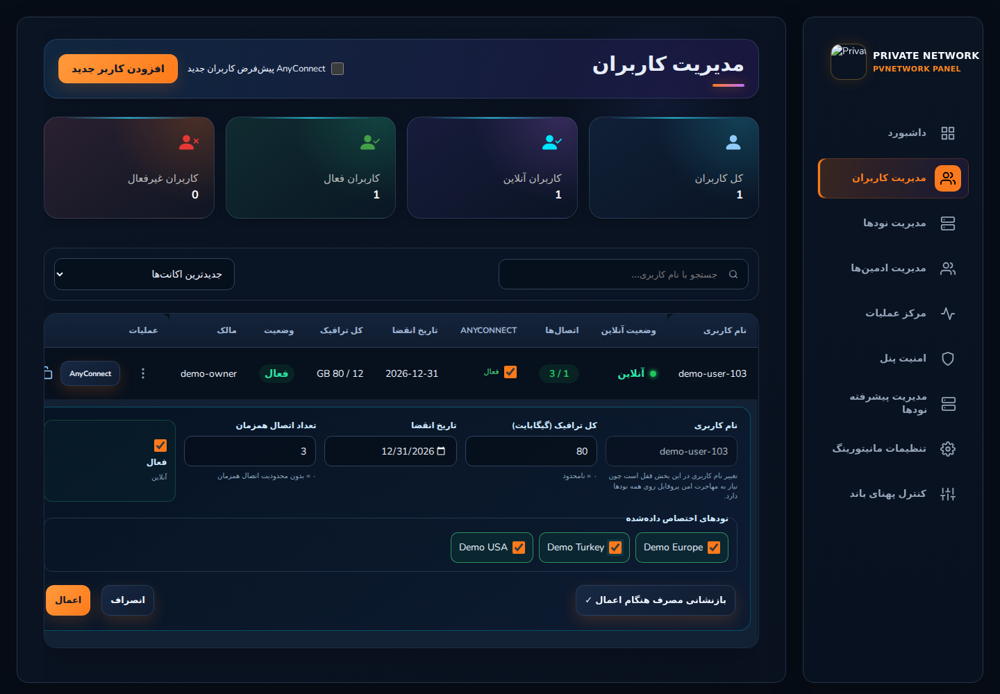
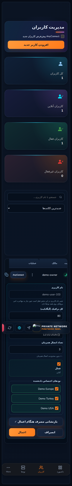
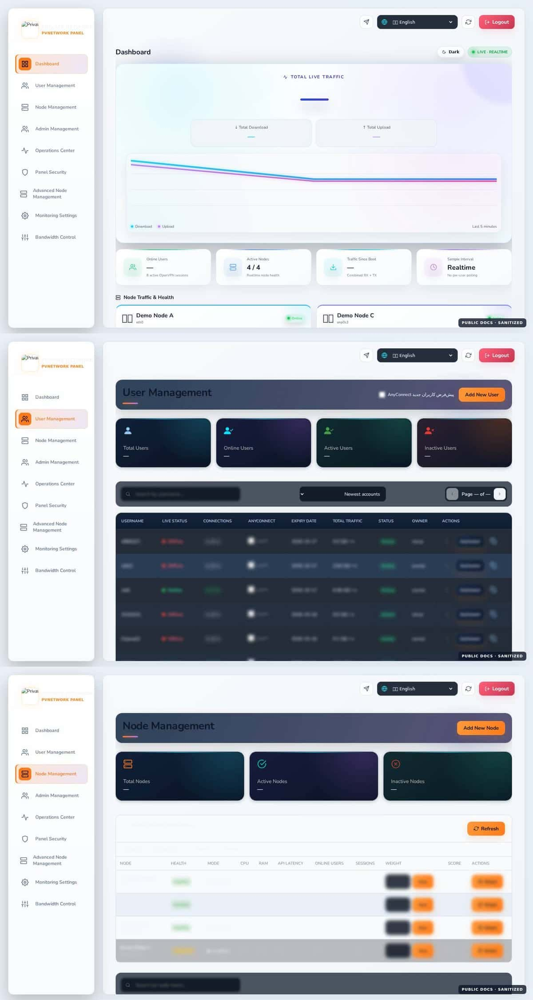
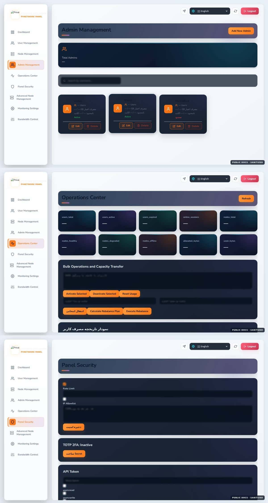
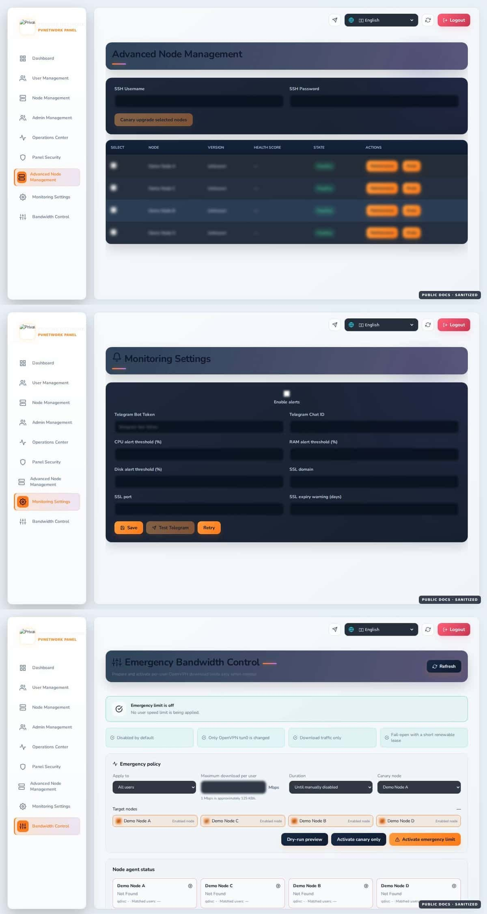
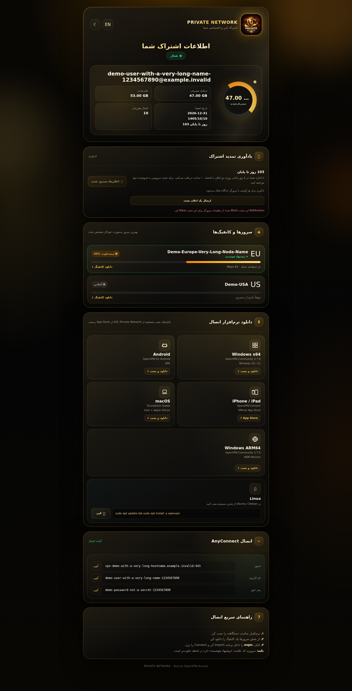
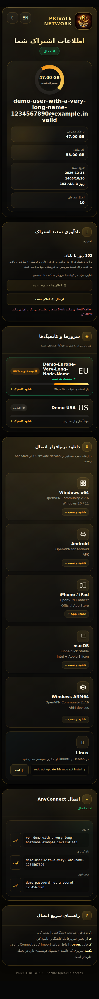
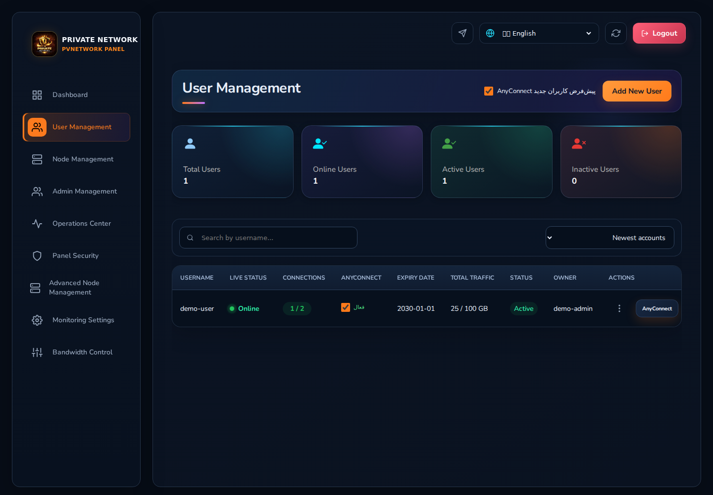
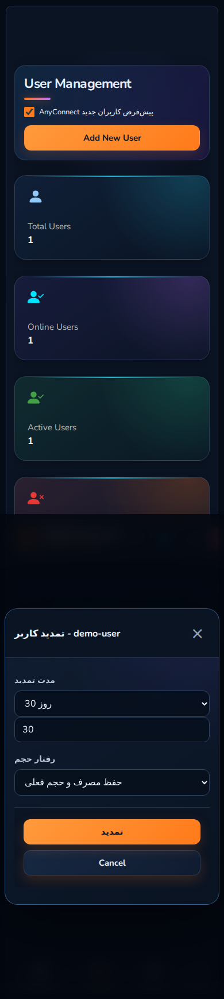

<div dir="rtl" align="right">

# PVNetwork Panel

**کنترل‌پلین چندنودی Production-Oriented برای OpenVPN با یکپارچه‌سازی اختیاری AnyConnect**

[](./VERSION)
[](#نیازمندیها)
[](./LICENSE)

[English](./README.md) · **فارسی**

## تغییرات v1.0.4 نسبت به v1.0.3

**PVN-025 — مالکیت کامل برند و Runtime توسط PVNetwork.** تمام شناسه‌های برنامه، سرویس، Package، Storage و Backup در سورس Track‌شده با نام PVNetwork یکدست شده‌اند. یک تست Blocking تمام فایل‌ها و مسیرهای Track‌شده را اسکن می‌کند تا شناسه محصول پنل قدیمی دوباره وارد سورس نشود. Runtime استاندارد روی `/opt/pvnetwork-panel` و `pvnetwork-panel.service` قرار گرفته و برای SQLite موجود و Language Preference مرورگر Compatibility امن در نظر گرفته شده است.

نسخه API، Python package، Frontend package و Release همگی روی **1.0.4** هماهنگ شده‌اند و Installer/Update فقط Releaseهای نگهداری‌شده در `DashSaman/OV-PvNetwork` را می‌گیرد. مهاجرت Production با Backup، Canary موازی و سوییچ Atomic Proxy انجام می‌شود.

آخرین Release: **v1.0.4** — [مشاهده Release](https://github.com/DashSaman/OV-PvNetwork/releases/tag/v1.0.4)

## تغییرات v1.0.3 نسبت به v1.0.2

**PVN-205 — ویرایش سریع داخل ردیف کاربر.** از منوی عملیات Users می‌توان Quick Edit را باز کرد و بدون رفتن به Modal کامل، حجم، تاریخ انقضا در حالت‌های مجاز، تعداد اتصال هم‌زمان، وضعیت فعال/غیرفعال، Node Assignment و Reset Usage را بررسی و اعمال کرد. Username عمداً Read-only است تا زمانی که Rename امن چندنودی در `PVN-022` پیاده‌سازی شود.





تغییر Assignment با Guard امن انجام می‌شود: نود حذف‌شده از Assignment به‌جای حذف Certificate فقط Deactivate می‌شود، پروفایل غیرفعال قدیمی در صورت امکان دوباره استفاده می‌شود و نود جدیدِ غیرقابل‌دسترس قبل از Mutation رد می‌شود. Sync وضعیت و ویرایش فقط روی نودهای Assigned انجام می‌شود. تست Browser واقعی برای فارسی RTL و انگلیسی LTR روی موبایل، تبلت و دسکتاپ اجرا می‌شود.

Release قبلی: **v1.0.3** — [مشاهده Release](https://github.com/DashSaman/OV-PvNetwork/releases/tag/v1.0.3)

PVNetwork Panel کنترل‌پلین مستقل PVNetwork برای مدیریت عملیاتی چندنودی است و امکانات لازم برای استفاده واقعی را ارائه می‌کند: مدیریت کاربران، تمدید، AnyConnect، سلامت نودها، مانیتورینگ، امنیت پنل، عملیات گروهی، کنترل پهنای‌باند، بکاپ/بازیابی و ابزارهای نصب و به‌روزرسانی امن‌تر.

> **قانون ثابت پروژه:** Production همیشه زیر بار و در حال استفاده فرض می‌شود. هر تغییر Production باید با ترتیب «Backup/Check → تغییر محدود → کمترین Restart لازم → Health Verification → آمادگی Rollback» انجام شود. مخزن عمومی نیز نباید اطلاعات واقعی کاربران یا زیرساخت و Secretها را داشته باشد.

## نمای تصویری پنل

### داشبورد، کاربران و نودها



### مدیریت ادمین، مرکز عملیات و امنیت



### مدیریت پیشرفته نود، مانیتورینگ و کنترل پهنای‌باند




### تصویر Subscription در v1.0.2





در v1.0.2 صفحه Subscription برای موبایل سخت‌گیرانه‌تر شده است: دکمه‌های Notification، کپی Linux و Copyهای AnyConnect حداقل فضای Touch مناسب دارند، Username/Host طولانی از صفحه بیرون نمی‌زنند و RTL فارسی / LTR انگلیسی بدون Horizontal Overflow باقی می‌ماند.





مستندات تصویری کامل:

- [راهنمای کامل تصویری فارسی](./docs/UI-GUIDE.fa.md)
- [راهنمای Responsive و Accessibility نسخه 1.0.x](./docs/RESPONSIVE-GUIDE.fa.md)
- [Complete English UI guide](./docs/UI-GUIDE.md)
- [English responsive & accessibility guide](./docs/RESPONSIVE-GUIDE.md)

## امکانات اصلی

| بخش | امکانات اصلی |
|---|---|
| کاربران | ساخت، ویرایش کامل، Quick Edit داخل ردیف، فعال/غیرفعال، حذف، تمدید، Reset Usage، Node Assignment، دانلود پروفایل و لینک اشتراک |
| تمدید | تمدید کاربر Expired بدون حذف، تمدید نامحدود، حالت‌های حفظ/ریست/افزایش حجم |
| AnyConnect | فعال/غیرفعال برای هر کاربر، ساخت یا تغییر رمز، هویت مشترک کاربر |
| نودها | افزودن و ویرایش نود، Health، Assignment، حذف کنترل‌شده |
| Fleet | Health Score، Maintenance، Drain/Resume، Upgrade و Retry کنترل‌شده |
| مانیتورینگ | ترافیک زنده، CPU/RAM/Uptime، هشدار تلگرام و پیام صریح قطع/وصل نود (Node DOWN/UP) |
| امنیت | IP Allowlist، Rate Limit، TOTP 2FA، API Token با Scope و Expiry |
| عملیات | عملیات گروهی کاربران، انتقال/Rebalance، تاریخچه مصرف و Audit/Operations |
| پهنای‌باند | Emergency Off، Preview/Canary/Activate Policy، گروه‌ها و وضعیت نودها |
| بکاپ | ساخت و دانلود بکاپ تأییدشده و Restore با تأیید صریح |
| Integration | API میرزا، API نود OpenVPN و Hookهای اختیاری AnyConnect/ocserv |
| UX نسخه 1.0.x | منوی کامل موبایل Main Admin، Modalهای Viewport-safe، Touch/Focus/Reduced-motion و تست Browser برای RTL/LTR |

## رفتار Responsive نسخه 1.0.x

در موبایل Dashboard، Users و Nodes مستقیم در Bottom Navigation هستند و بخش‌های Admins، Operations، Security، Fleet، Monitoring و Bandwidth از منوی **More** در دسترس‌اند. بنابراین هیچ بخش اصلی Main Admin فقط به Sidebar دسکتاپ وابسته نیست.

CI مسیرهای اصلی را روی عرض‌های `360`, `375`, `390`, `430`, `768`, `1024`, `1366`, `1440`, `1920` در English LTR و Persian RTL بررسی می‌کند. Touch targetها، Modalها، جدول‌ها، Text wrapping و Horizontal Overflow نیز در Release Gate ثبت شده‌اند.

برای جزئیات: [UX Audit](./docs/UX-AUDIT.md) و [QA Release Gate](./docs/QA-RELEASE-GATE.md).

## نصب سریع

روی یک سرور **تازه** و با کاربر `root` اجرا کنید:

```bash
bash <(curl -fsSL https://raw.githubusercontent.com/DashSaman/OV-PvNetwork/v1.0.4/install.sh)
```

Installer از Tag ثابت Release استفاده می‌کند و نباید برای Production موجود کورکورانه اجرا شود.

بعد از نصب، در Deploymentهایی که Lifecycle Manager فعال است:

```bash
pvnetwork status
pvnetwork doctor
pvnetwork version
pvnetwork backup
pvnetwork update
pvnetwork rollback
```

اگر روی سرور شما از قبل نسخه قدیمی پنل یا سرویس‌های دیگری فعال است، Fresh Installer را مستقیم اجرا نکنید؛ ابتدا Health، Backup و مسیر Update/Migration را بررسی کنید.

مستندات:

- [نصب](./docs/INSTALLATION.md)
- [معماری](./docs/ARCHITECTURE.md)
- [آپدیت و Rollback](./docs/UPDATES.md)
- [تمدید کاربران](./docs/RENEWAL.md)
- [مقایسه امکانات](./docs/FEATURE-MATRIX.md)
- [ماتریس کمبود نسبت به پنل‌های دیگر](./docs/COMPETITOR-GAP-MATRIX.md)
- [Backlog کامل شماره‌دار](./docs/FEATURE-BACKLOG.md)
- [Roadmap](./ROADMAP.md)

## معماری

```text
                         ┌──────────────────────────────┐
                         │       PVNetwork Panel       │
                         │       Panel / API / UI      │
                         └──────────────┬───────────────┘
                                        │
                    assignment / health / metrics / profile API
                                        │
             ┌──────────────────────────┼──────────────────────────┐
             │                          │                          │
      ┌──────▼──────┐            ┌──────▼──────┐            ┌──────▼──────┐
      │  OV-Node A  │            │  OV-Node B  │     ...    │  OV-Node N  │
      │  OpenVPN    │            │  OpenVPN    │            │  OpenVPN    │
      └─────────────┘            └─────────────┘            └─────────────┘
```

Integrationهای اختیاری می‌توانند شامل AnyConnect/ocserv، Mirza، Telegram و Policyهای مانیتورینگ/پهنای‌باند باشند.

## نیازمندی‌ها

| جزء | حداقل | پیشنهادی |
|---|---:|---:|
| پنل | 1 vCPU / 1 GB RAM / 10 GB | 2 vCPU / 2 GB RAM / 20 GB SSD |
| نود VPN | 1 vCPU / 512 MB RAM / 5 GB | 1–2 vCPU / 1 GB+ RAM / 10 GB |

هدف Installer: Ubuntu 22.04 LTS، Ubuntu 24.04 LTS و Debian 12 با Best-effort در تفاوت پکیج‌های Upstream.

## چرخه امن Production

1. وضعیت فعلی سرویس و Deployment را بررسی کنید.
2. قبل از Update بکاپ بگیرید.
3. فقط Release و Migration بررسی‌شده را اعمال کنید.
4. Build و تست‌های خودکار را اجرا کنید.
5. فقط سرویس لازم را Restart کنید.
6. Health محلی/عمومی و Workflowهای حیاتی را Verify کنید.
7. در صورت Fail شدن Verification فوراً Rollback کنید.

Node Automation نباید برای راحتی نصب، Firewall را Flush کند، Default Route را عوض کند یا سرویس/Tunnel نامرتبط را حذف کند.

## مدیریت پروژه و Agentها

`AGENTS.md` قرارداد دائمی اجرای پروژه است. هر کار یک شماره ثابت `PVN-xxx` دارد. Backlog جزئی شامل UI/UX، چرخه کاربر، Device، Node/Fleet، Monitoring، Enterprise Identity، Automation، Protocolهای آینده مانند Xray/WireGuard، Installer/HA/DR و Migration/Client Compatibility است.

هیچ Task فقط با نوشته‌شدن کد `[x]` نمی‌شود؛ تست، Build/Compile، Responsive/Accessibility، Sanitization مخزن و در صورت ارتباط با Production، Health Verification باید پاس شوند.

## سیاست Release

- `v1.0.0` خط پایه Immutable باقی می‌ماند.
- `v1.0.1` Hardening سازگار UI/UX/Responsive/Governance را اضافه می‌کند.
- Patch Releaseها Fix سازگار هستند.
- Minor Releaseها Feature سازگار اضافه می‌کنند.
- Major Release می‌تواند تغییر Breaking معماری/Protocol داشته باشد.
- هر تغییر Production-visible باید در `CHANGELOG.md` ثبت و با GitHub Release جدید منتشر شود.

## امنیت مخزن عمومی

`.env`، دیتابیس، API/JWT Secret، SSH Credential، Private Key، TLS Material، فایل `.ovpn` کاربران و Screenshot واقعی حاوی اطلاعات Production نباید Commit شوند. تصاویر عمومی فقط Demo/Sanitized هستند.

راهنمای امنیت: [SECURITY.md](./SECURITY.md)

## اعتبار پروژه

PVNetwork شامل تغییراتی بر پایه یک foundation دارای مجوز MIT است و با کامپوننت نود `primeZdev/ov-node` کار می‌کند. Attribution لازم در [NOTICE.md](./NOTICE.md) و [LICENSE](./LICENSE) حفظ شده است.

</div>
