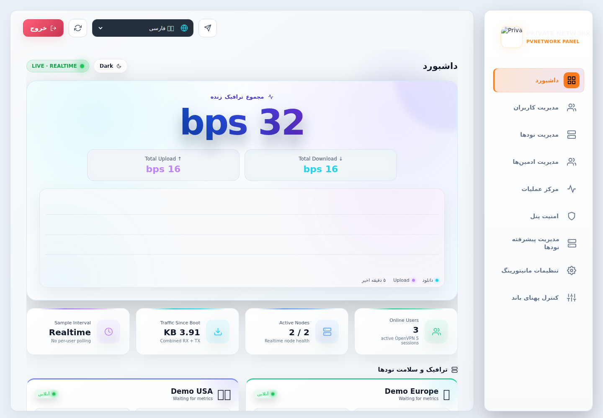
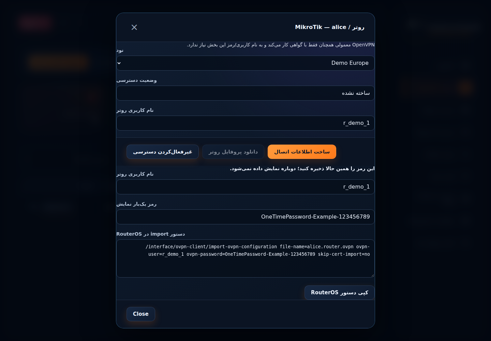
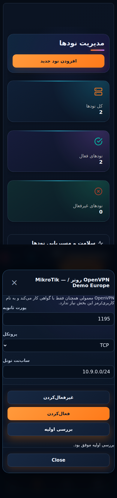
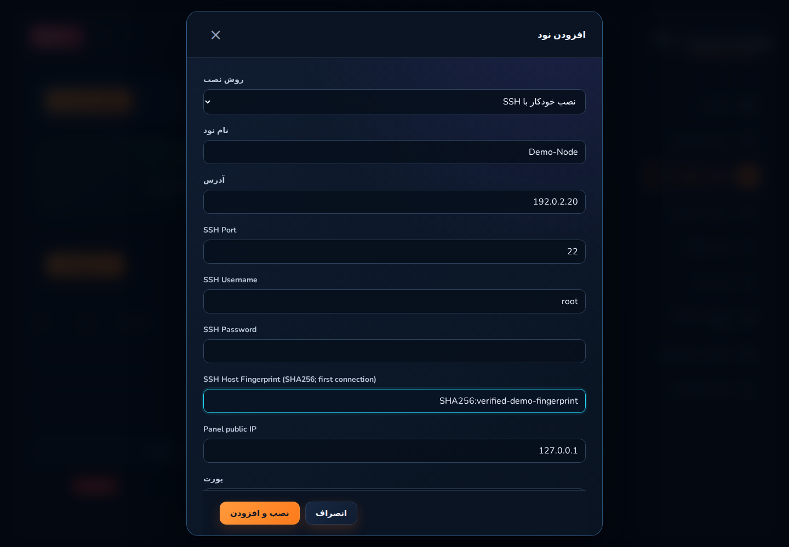
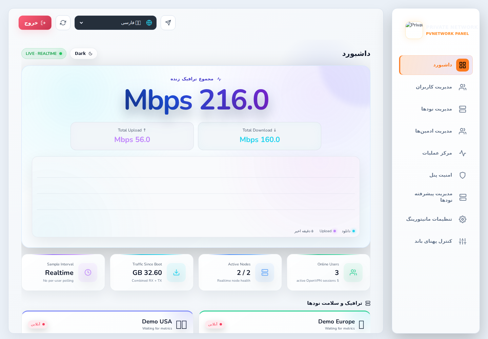
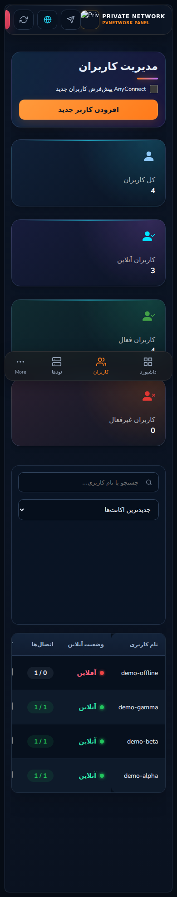
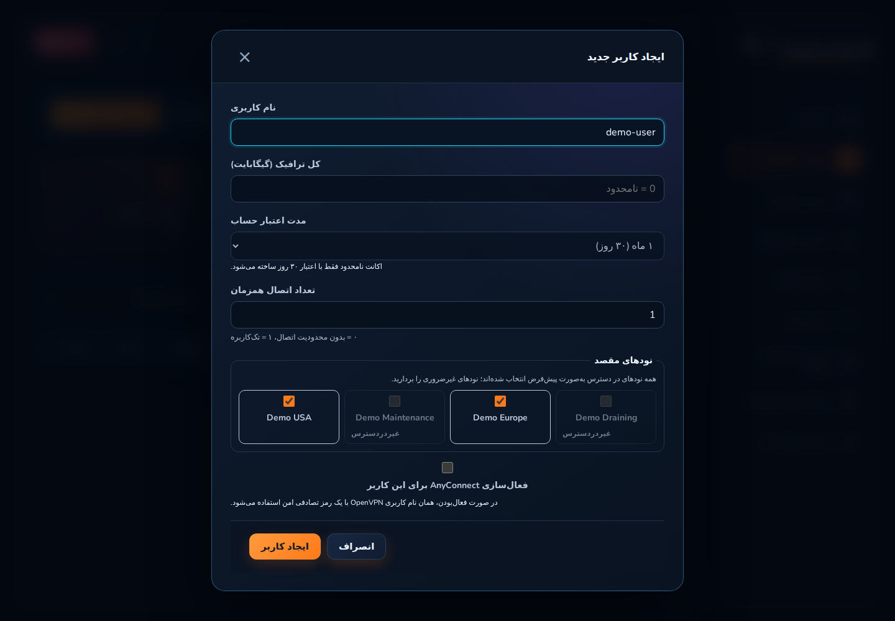
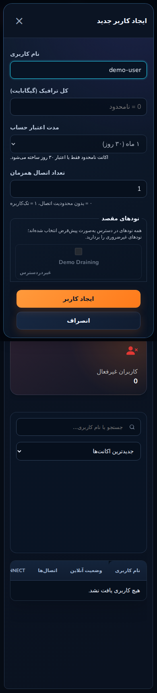

<div dir="rtl" align="right">

# PVNetwork Panel

**کنترل‌پلین چندنودی Production-Oriented برای OpenVPN با یکپارچه‌سازی اختیاری AnyConnect**

[](./VERSION)
[](#نیازمندیها)
[](./LICENSE)

[English](./README.md) · **فارسی**

## تغییرات v1.0.25 نسبت به v1.0.24

**PVN-1011 — بررسی آمادگی Router + خطاهای قابل‌اقدام اعتبارنامه.** نبودِ نام کاربری/رمز به این ریشه‌یابی شد که قابلیت Router هرگز روی هیچ نودی فعال نشده بود. تیک Router در ساخت کاربر حالا وضعیت زنده نودهای انتخابی را موقع تیک‌خوردن بررسی می‌کند (تعداد آماده، یا راهنمای قرمز گام‌به‌گام فعال‌سازی وقتی هیچ‌کدام آماده نیستند) و خطاهای اعتبارنامه به پیام‌های قابل‌اقدام در ۱۳ زبان ترجمه می‌شوند.

خط انتشار فعلی: **v1.0.25** — [یادداشت انتشار](./docs/RELEASE-NOTES-v1.0.25.fa.md).

## تغییرات v1.0.24 نسبت به v1.0.23

**PVN-1009 — احیای ران‌تایم صفحه اشتراک + رفع پنل MikroTik هنگام ساخت.** CSP سخت‌گیرانه v1.0.8 همه اسکریپت‌های صفحه اشتراک عمومی را بی‌صدا بلاک کرده بود (شمارنده تمدید گیر، تغییر زبان/تم کار نمی‌کرد)؛ آن صفحه حالا اجازه اسکریپت inline دارد و پنل ادمین سیاست سخت می‌ماند. کتابخانه QR از بک‌اند با MIME درست سرو می‌شود (nginx قبلاً octet-stream می‌داد). پنل Router/MikroTik هنگام ساخت حالا مطمئن ظاهر می‌شود و آدرس سرور هر نود، اعتبارنامه یک‌بارمصرف، دکمه دانلود پروفایل Router و آموزش گام‌به‌گام RouterOS را نشان می‌دهد.

انتشار قبلی: **v1.0.24** — [یادداشت انتشار](./docs/RELEASE-NOTES-v1.0.24.fa.md).

## تغییرات v1.0.23 نسبت به v1.0.22

**PVN-211 — صفحه اشتراک هوشمند: کد QR و راهنمای هر دستگاه.** صفحه اشتراک عمومی حالا QR کل صفحه (بازکردن اشتراک روی دستگاه دیگر) و دکمه QR برای هر سرور که URL دانلود همان کانفیگ را برای اسکن با دوربین گوشی رندر می‌کند؛ QRها سمت کلاینت با کتابخانه MIT به‌صورت same-origin ساخته می‌شوند (بدون CDN، سازگار با CSP). راهنمای اتصال سریع هر دستگاه (ویندوز/مک/آیفون/اندروید/لینوکس/MikroTik) فارسی و انگلیسی اضافه شد. بدون هیچ تغییری در API، احراز هویت، OpenVPN یا Session.

انتشار قبلی: **v1.0.23** — [یادداشت انتشار](./docs/RELEASE-NOTES-v1.0.23.fa.md).

## تغییرات v1.0.22 نسبت به v1.0.21

**PVN-1008 — نصب خودکار قابل‌اتکای نود.** رایج‌ترین خرابی‌های نصب خودکار افزودن نود رفع شد: IP مبدأ پنل اختیاری شد و روی خود نود از نشست SSH تشخیص داده می‌شود (پیش‌پر hostname پشت دامنه‌های پراکسی، دیپلوی را قطع می‌کرد و IP دستی اشتباه، پنل را بعد از نصب کامل پشت فایروال نود می‌انداخت)؛ قواعد allow فایروال دیگر روی زنجیره‌های INPUT خالی خطا نمی‌دهند؛ منابع IPv6 شاخه ip6tables درست دارند؛ و خطاهای وریفای پس از نصب مشخص می‌گویند چه چیزی را بررسی کنید. ثبت دستی و نودهای موجود بدون تغییرند.

انتشار قبلی: **v1.0.22** — [یادداشت انتشار](./docs/RELEASE-NOTES-v1.0.22.fa.md).

## تغییرات v1.0.21 نسبت به v1.0.20

**PVN-1006 + PVN-1007 — یکدستی کامل زبان و اعتبارنامه Router هنگام ساخت کاربر (پچ ترکیبی به درخواست مالک).** باقی اختلاط زبان رفع شد: ۲۸ کلید کاتالوگ زیر انگلیسی و همه زبان‌های غیر فارسی مقدار فارسی داشتند و پنل بکاپ/بازیابی، مودال AnyConnect و دیالوگ‌های حذف نماینده کاملاً فارسی hard-code بودند — همه اکنون در ۱۳ زبان ترجمه شده‌اند با گیت‌های خلوص دائمی CI. به‌علاوه فرم ساخت کاربر گزینه Router / MikroTik می‌گیرد که پس از ساخت، نام کاربری/رمز یک‌بارمصرف برای هر نود دارای قابلیت Router تولید و نمایش می‌دهد؛ پروفایل OpenVPN عادی بدون رمز و بدون تغییر باقی می‌ماند.

انتشار قبلی: **v1.0.21** — [یادداشت انتشار](./docs/RELEASE-NOTES-v1.0.21.fa.md).

## تغییرات v1.0.20 نسبت به v1.0.19

**PVN-1005 — یکدستی کامل تغییر زبان.** اختلاط زبان رابط کاربری رفع شد: ۴۵ کلید که در هیچ کاتالوگ زبانی نبودند (برچسب‌های نماینده/اکانت نامحدود، مودال تمدید، اعتبارسنجی‌ها، ناوبری، دکمه‌های عملیات، بازخورد کپی، منوی مرتب‌سازی) صرف‌نظر از زبان انتخابی، پیش‌فرض فارسی یا انگلیسی hard-code شده نمایش می‌دادند. همه کلیدها اکنون در ۱۳ زبان ترجمه شده‌اند، جهت مودال Router/MikroTik از زبان فعال پیروی می‌کند و یک گیت دائمی CI می‌خواهد هر کلید ترجمه استفاده‌شده در هر زبان ارسالی resolve شود.

انتشار قبلی: **v1.0.20** — [یادداشت انتشار](./docs/RELEASE-NOTES-v1.0.20.fa.md).

## تغییرات v1.0.19 نسبت به v1.0.18

**PVN-1003 — رفع رگرسیون صفحه سفید و سخت‌سازی.** صفحه خالی زنده‌ای که با دیپلوی فرانت‌اند v1.0.18 وارد شد تعمیر شد (باندل محلی مسیر پایه asset اشتباه داشت چون Vite متغیر `URLPATH` را می‌خواند نه `VITE_URLPATH`). ایندکس SPA اکنون با `Cache-Control: no-cache` سرو می‌شود تا تعویض اتمیک asset هرگز مرورگر کش‌شده را گیر نیندازد. هر ۱۱ زبان دوم اکنون کل کاتالوگ ۴۰۷ کلیدی UI را پوشش می‌دهند و دیتابیس/نقش لاگین Production با مهاجرت بکاپ-اول به `pvnetwork_panel` تکمیل شد (دیتابیس قبلی به‌عنوان رول‌بک نگه داشته شد). بدون هیچ تغییری در OpenVPN/نود/Router/Session.

انتشار قبلی: **v1.0.19** — [یادداشت انتشار](./docs/RELEASE-NOTES-v1.0.19.fa.md).

## تغییرات v1.0.18 نسبت به v1.0.17

**PVN-1002 — نشان نسخه ریلیز در پنل.** هدر داشبورد اکنون نسخه در حال اجرای پنل (مثلاً `v1.0.18`) را کنار نشان `LIVE · REALTIME` نمایش می‌دهد. مقدار در زمان اجرا از اندپوینت عمومی `/healthz` خوانده می‌شود تا همیشه با ریلیز واقعاً مستقرشده مطابقت داشته باشد؛ خطای خواندن به‌صورت بی‌صدا نشان را حذف می‌کند. فقط نمایشی — بدون هیچ تغییری در API، احراز هویت، OpenVPN، نود، Listener Router یا Session.

انتشار قبلی: **v1.0.18** — [یادداشت انتشار](./docs/RELEASE-NOTES-v1.0.18.fa.md).

## تغییرات v1.0.17 نسبت به v1.0.16

**PVN-1000 — پایدارسازی هشدار آستانه CPU.** هشدار High CPU اکنون به ۲ نمونه متوالی روی/بالای آستانه نیاز دارد و ارسال Resolved به ۲ نمونه متوالی بازیابی‌شده با حاشیه قطعی ۵ واحدی می‌رسد. وضعیت آستانه و شمارنده نمونه‌های متوالی پس از Restart مانیتور حفظ می‌شوند و نودهای آفلاین دیگر شمارنده CPU کهنه مسلح نگه نمی‌دارند. هشدارهای RAM/Disk/Sync/SSL و گذار DOWN/UP نود بدون تغییر می‌مانند؛ هیچ تغییری در OpenVPN، نود، Listener Router، پروفایل یا Session ایجاد نمی‌شود.

انتشار قبلی: **v1.0.17** — [یادداشت انتشار](./docs/RELEASE-NOTES-v1.0.17.fa.md).

## تغییرات v1.0.16 نسبت به v1.0.15

**PVN-022 — تغییر امن نام کاربری روی چند نود.** تغییر Username دیگر نیاز به حذف و ساخت دوباره کاربر ندارد؛ UUID، سابقه مصرف، سهمیه، تاریخ انقضا، محدودیت دستگاه، هویت AnyConnect، هویت UUID-based مربوط به Router/MikroTik و Node Assignmentها بدون تغییر حفظ می‌شوند. ابتدا هویت OpenVPN جدید روی تمام نودهای تخصیص‌یافته ساخته و بررسی می‌شود و سپس Cutover مرکزی انجام می‌گیرد.

پس از Cutover موفق، **پروفایل‌های OpenVPN قبلی فوراً باطل می‌شوند** و هیچ Grace Period وجود ندارد. CN قبلی فقط برای همان کاربر قطع، revoke و حذف می‌شود و سرویس اصلی OpenVPN restart نمی‌شود. خطای قبل از Commit به هویت قبلی rollback می‌شود؛ خطای پاک‌سازی بعد از Commit نام جدید را معتبر نگه می‌دارد و Job در `cleanup_pending` برای Retry امن باقی می‌ماند.

انتشار قبلی: **v1.0.16** — [یادداشت انتشار](./docs/RELEASE-NOTES-v1.0.16.fa.md).

## تغییرات v1.0.15 نسبت به v1.0.14

**PVN-376 / PVN-398 — حفظ سرویس OpenVPN در چرخه هر کاربر.** عملیات Enable، Disable و Delete فقط روی همان Client اثر می‌گذارند: CCD به‌صورت per-CN تغییر می‌کند، در Disable/Delete فقط همان Common Name از Management Socket قطع می‌شود و دیگر برای یک کاربر کل OpenVPN عادی Restart نمی‌شود.

Upgrade نودهای موجود اکنون Patch چرخه کاربر را نیز نصب می‌کند. Delete دیگر به Installer تعاملی اختیاری وابسته نیست؛ Certificate همان کاربر با EasyRSA revoke می‌شود، CRL به‌صورت اتمیک بازتولید/منتشر می‌شود و فقط artifactهای PKI همان Client پس از revoke موفق پاک می‌شوند. Migration دیتابیس لازم نیست.

خط انتشار فعلی: **v1.0.15** — [یادداشت انتشار](./docs/RELEASE-NOTES-v1.0.15.fa.md).

## تغییرات v1.0.14 نسبت به v1.0.13

**PVN-585 — رگرسیون امنیتی.** چهار ایراد قابل‌بازتولید اصلاح شد: ناسازگاری تشخیص IP پشت Nginx برای Allowlist، عبور API Token به‌عنوان ادمین اصلی تعاملی در Security، پذیرش Prefix غیرمجاز در fallback توکن و طبقه‌بندی Scope با substring.

تست‌های دائمی JWT/Admin/API Token/IDOR/SQL/CORS/CSRF/XSS/Redaction/Permission و یک Probe فقط‌خواندنی و بدون Credential برای Production اضافه شده‌اند. این نسخه معماری جدید SSO/RBAC/Passkey/OpenVPN/Node/Routing اضافه نمی‌کند.

خط انتشار فعلی: **v1.0.14** — [یادداشت انتشار](./docs/RELEASE-NOTES-v1.0.14.fa.md).

## تغییرات v1.0.13 نسبت به v1.0.12

**PVN-894 — بستن امن و Fail-Closed کاناری Production.** از این نسخه، Canary پورت `19002` فقط وقتی اجازه Retire دارد که فایل فعال Nginx واقعاً به پورت اصلی `19001` برگشته باشد، `nginx -t` موفق باشد، Nginx با موفقیت Reload شود و هر دو Health Check محلی و عمومی HTTP 200 بدهند. Guard نتیجه را به‌صورت `CANARY_RETIRE_SAFE=YES/NO` ثبت می‌کند تا Rollout قابل Audit باشد.

این Patch مستقیماً حالت خطایی را می‌بندد که در Rollout نسخه v1.0.12 باعث شد Canary در حالی بسته شود که Nginx هنوز به آن Proxy می‌کرد و برای مدت کوتاه HTTP 502 دیده شود. OpenVPN، Nodeها، Router compatibility، Certificateها، Profileها و Tunnelهای فعال تغییری نمی‌کنند.

خط انتشار فعلی: **v1.0.13** — [یادداشت انتشار](./docs/RELEASE-NOTES-v1.0.13.fa.md).

## تغییرات v1.0.12 نسبت به v1.0.11

**PVN-032 — تنظیمات امن Runtime برای پنل و مدیر اصلی.** مدیر اصلی پس از ورود می‌تواند Path پنل و Username/Password خودش را از Security Settings تغییر دهد. قبل از هر تغییر رمز فعلی دوباره بررسی می‌شود، رمز جدید فقط به‌صورت Hash ذخیره می‌شود و تغییر Credential با Generation جدید JWTهای قدیمی مدیر اصلی را نامعتبر می‌کند؛ مرورگر آغازکننده با Handoff کنترل‌شده Session خود را حفظ می‌کند.

تغییر Path ابتدا با Build و Canary روی `127.0.0.1:19002` بررسی می‌شود و فقط در صورت موفقیت به Panel اصلی سوییچ می‌شود. Path قبلی 300 ثانیه HTTP 307 می‌دهد و سپس 404 می‌شود. در شکست Verification، Environment و Frontend قبلی خودکار برمی‌گردند. OpenVPN عادی، Listener سازگاری Router، Nodeها، Profileها، Certificateها و Tunnelهای فعال کاربران توسط PVN-032 Restart یا Reconfigure نمی‌شوند.

خط انتشار فعلی: **v1.0.12** — [یادداشت انتشار](./docs/RELEASE-NOTES-v1.0.12.fa.md).

## تغییرات v1.0.11 نسبت به v1.0.10

**PVN-033 — اصلاح شمارش واقعی کاربران آنلاین در Production.** پاسخ موفق Node با `data: null` اکنون به‌معنی Snapshot تازه با صفر کاربر است، نه خطای Poll؛ بنابراین وضعیت آنلاین قدیمی دیگر به‌خاطر Grace Window خطای موقت باقی نمی‌ماند. Node Cardهای Dashboard نیز از همان Mapping کاربرهای واقعی PVNetwork استفاده می‌کنند که عدد کلی Online Users و صفحه User Management استفاده می‌کنند. Common Nameهای یتیم/ناشناخته در عدد کاربران مدیریت‌شده شمرده نمی‌شوند و فقط به‌عنوان Drift تشخیصی ثبت می‌شوند؛ این Patch هیچ Profile یا Certificate را revoke نمی‌کند و به Sessionهای اجرایی Device Limit نمی‌نویسد.



خط انتشار فعلی: **v1.0.11** — [یادداشت انتشار](./docs/RELEASE-NOTES-v1.0.11.fa.md).

## تغییرات v1.0.10 نسبت به v1.0.9

**PVN-030 — مهاجرت backward-compatible نام‌های پروتکل متعلق به PVNetwork.** توکن‌های جدید با `pvn_` ساخته می‌شوند و `ovp_`های قبلی همچنان کار می‌کنند. Callbackهای Node هم Header جدید `X-PVNetwork-Node-Key` و هم `X-OV-Node-Key` قدیمی را می‌پذیرند و اگر هر دو با مقدار متفاوت فرستاده شوند درخواست رد می‌شود. Helperهای تزریق‌شده Node هنگام Upgrade به `_pvnetwork_*` منتقل می‌شوند، ولی نام‌های upstream مربوط به `ov-node` و OpenVPN عادی دست‌نخورده می‌مانند.

خط انتشار فعلی: **v1.0.10** — [یادداشت انتشار](./docs/RELEASE-NOTES-v1.0.10.fa.md).

## تغییرات v1.0.9 نسبت به v1.0.8

**PVN-029 — سازگاری اختیاری Router / MikroTik بدون تغییر OpenVPN عادی.** کاربران معمولی همان Profile گواهی‌محور قبلی را استفاده می‌کنند و به Username/Password نیاز ندارند. برای Nodeهای سازگار می‌توان به‌صورت صریح یک Listener دوم با Port/Subnet/Firewall جدا فعال کرد که هم‌زمان Certificate و Password یک‌بارساخت را بررسی می‌کند و Profile مخصوص Router می‌دهد.

هویت همچنان Common Name همان Certificate کاربر است؛ بنابراین Session/Device accounting به همان User PVNetwork وصل می‌ماند. Credential روتر برای هر User/Node جداست، Password خام فقط هنگام Generate/Rotate یک‌بار نمایش داده می‌شود و ذخیره نمی‌شود، و Node قدیمی به‌جای خراب‌کردن OpenVPN عادی فقط `upgrade_required` برمی‌گرداند.





خط انتشار فعلی: **v1.0.9** — [یادداشت انتشار](./docs/RELEASE-NOTES-v1.0.9.fa.md).

## تغییرات v1.0.8 نسبت به v1.0.7

**PVN-028 — سخت‌سازی امنیت Production بدون تغییر مدل اصلی OpenVPN.** رمز ادمین اصلی به hash یک‌طرفه مهاجرت می‌کند، انتشار docs/schema عمومی تابع DOC است، rate-limit لاگین و security headerها سخت‌تر شده‌اند، SSH بدون تأیید fingerprint کلید host ناشناخته را قبول نمی‌کند، audit dependency/static وارد CI شده و اعمال firewall فقط با inventory و rollback تایمردار انجام می‌شود. پروفایل certificate-only و بدون username/password برای کاربران عادی همان حالت پیش‌فرض باقی می‌ماند.



خط انتشار فعلی: **v1.0.8** — [یادداشت انتشار](./docs/RELEASE-NOTES-v1.0.8.fa.md).

## تغییرات v1.0.7 نسبت به v1.0.6

**PVN-031 — حذف race نهایی در نمایش کاربران آنلاین.**

 داشبورد و مدیریت کاربران اکنون یک Snapshot کوتاه‌عمر مشترک از وضعیت آنلاین می‌خوانند. صفحه کاربران به‌جای انتظار تا ۱۰ ثانیه برای دریافت دوباره کل لیست، هر یک ثانیه فقط Presence سبک و Scope‌شده را می‌گیرد و Full User List با فاصله بیشتر تازه می‌شود.

این Hotfix فقط نمایشی است: چیزی داخل `active_sessions` نمی‌نویسد، Device Limit را تغییر نمی‌دهد و Profileهای OpenVPN یا وضعیت Nodeها را دستکاری نمی‌کند. هدف فقط این است که دو صفحه با وجود استفاده از منطق مشترک، به‌خاطر افتادن روی دو Sample زمانی متفاوت عدد متفاوت نشان ندهند.

آخرین Release: **v1.0.7** — [توضیحات Release](./docs/RELEASE-NOTES-v1.0.7.fa.md).

## تغییرات v1.0.6 نسبت به v1.0.5

**PVN-027 — یک مرجع واحد برای کاربران آنلاین در Dashboard و Users.**


 پنل اکنون Session heartbeatهای تازه مرکزی را با fallback مستقیم و صرفاً نمایشی Node ترکیب می‌کند، Userهای فعلی PVNetwork را بین Nodeها Deduplicate می‌کند و Profileهای قدیمی/یتیم Node را در عدد کلی کاربران آنلاین حساب نمی‌کند. این دقیقاً اختلافی را برطرف می‌کند که یک Node کاربر زنده OpenVPN داشت اما session hook آن در `active_sessions` مرکزی دیده نمی‌شد.

Fallback هیچ Session اجرایی در دیتابیس نمی‌سازد و Device Limit را تغییر نمی‌دهد. Raw count هر Node روی Node Card باقی می‌ماند، اما عدد کلی Dashboard و وضعیت Online در User Management از یک snapshot مشترک User Presence می‌آیند. Timeout موقت Node نیز session مرکزی معتبر را پاک نمی‌کند و برای مدت کوتاه از snapshot cache‌شده استفاده می‌شود.

آخرین Release: **v1.0.6** — [مشاهده Release](https://github.com/DashSaman/OV-PvNetwork/releases/tag/v1.0.6)

## تغییرات v1.0.5 نسبت به v1.0.4

**PVN-026 — انتخاب Node هنگام ساخت User.** در پنجره Add User همه نودهای شناخته‌شده نمایش داده می‌شوند؛ همه نودهای Available به‌صورت پیش‌فرض انتخاب‌اند و Nodeهای Offline/Drain/Maintenance دیده می‌شوند اما قابل انتخاب نیستند. ادمین می‌تواند قبل از ساخت، هر Node غیرضروری را بردارد؛ Backend ابتدا Assignment انتخاب‌شده را ثبت می‌کند و Profile فقط روی همان Nodeها Provision می‌شود.





برای سازگاری، APIهایی که `node_ids` نمی‌فرستند همچنان همه Nodeهای Available را انتخاب می‌کنند. Assignment صریح مرجع نهایی است: Reconciler می‌تواند Profile گم‌شده را روی Node انتخاب‌شده ترمیم کند اما اجازه ندارد User را خودکار روی Node جدیدی گسترش دهد. این جریان در فارسی/انگلیسی و اندازه‌های موبایل، تبلت و دسکتاپ تست شده است.

Release قبلی: **v1.0.5** — [مشاهده Release](https://github.com/DashSaman/OV-PvNetwork/releases/tag/v1.0.5)

## تغییرات v1.0.4 نسبت به v1.0.3

**PVN-025 — مالکیت کامل برند و Runtime توسط PVNetwork.** تمام شناسه‌های برنامه، سرویس، Package، Storage و Backup در سورس Track‌شده با نام PVNetwork یکدست شده‌اند. یک تست Blocking تمام فایل‌ها و مسیرهای Track‌شده را اسکن می‌کند تا شناسه محصول پنل قدیمی دوباره وارد سورس نشود. Runtime استاندارد روی `/opt/pvnetwork-panel` و `pvnetwork-panel.service` قرار گرفته و برای SQLite موجود و Language Preference مرورگر Compatibility امن در نظر گرفته شده است.

نسخه API، Python package، Frontend package و Release همگی روی **1.0.4** هماهنگ شده‌اند و Installer/Update فقط Releaseهای نگهداری‌شده در `DashSaman/OV-PvNetwork` را می‌گیرد. مهاجرت Production با Backup، Canary موازی و سوییچ Atomic Proxy انجام می‌شود.

Release قبلی: **v1.0.4** — [مشاهده Release](https://github.com/DashSaman/OV-PvNetwork/releases/tag/v1.0.4)

## تغییرات v1.0.3 نسبت به v1.0.2

**PVN-205 — ویرایش سریع داخل ردیف کاربر.** از منوی عملیات Users می‌توان Quick Edit را باز کرد و بدون رفتن به Modal کامل، حجم، تاریخ انقضا در حالت‌های مجاز، تعداد اتصال هم‌زمان، وضعیت فعال/غیرفعال، Node Assignment و Reset Usage را بررسی و اعمال کرد. Username عمداً Read-only است تا زمانی که Rename امن چندنودی در `PVN-022` پیاده‌سازی شود.


تغییر Assignment با Guard امن انجام می‌شود: نود حذف‌شده از Assignment به‌جای حذف Certificate فقط Deactivate می‌شود، پروفایل غیرفعال قدیمی در صورت امکان دوباره استفاده می‌شود و نود جدیدِ غیرقابل‌دسترس قبل از Mutation رد می‌شود. Sync وضعیت و ویرایش فقط روی نودهای Assigned انجام می‌شود. تست Browser واقعی برای فارسی RTL و انگلیسی LTR روی موبایل، تبلت و دسکتاپ اجرا می‌شود.

Release قبلی: **v1.0.3** — [مشاهده Release](https://github.com/DashSaman/OV-PvNetwork/releases/tag/v1.0.3)

PVNetwork Panel کنترل‌پلین مستقل PVNetwork برای مدیریت عملیاتی چندنودی است و امکانات لازم برای استفاده واقعی را ارائه می‌کند: مدیریت کاربران، تمدید، AnyConnect، سلامت نودها، مانیتورینگ، امنیت پنل، عملیات گروهی، کنترل پهنای‌باند، بکاپ/بازیابی و ابزارهای نصب و به‌روزرسانی امن‌تر.

> **قانون ثابت پروژه:** Production همیشه زیر بار و در حال استفاده فرض می‌شود. هر تغییر Production باید با ترتیب «Backup/Check → تغییر محدود → کمترین Restart لازم → Health Verification → آمادگی Rollback» انجام شود. مخزن عمومی نیز نباید اطلاعات واقعی کاربران یا زیرساخت و Secretها را داشته باشد.

## نمای تصویری پنل

### داشبورد، کاربران و نودها


### مدیریت ادمین، مرکز عملیات و امنیت


### مدیریت پیشرفته نود، مانیتورینگ و کنترل پهنای‌باند


### تصویر Subscription در v1.0.2


در v1.0.2 صفحه Subscription برای موبایل سخت‌گیرانه‌تر شده است: دکمه‌های Notification، کپی Linux و Copyهای AnyConnect حداقل فضای Touch مناسب دارند، Username/Host طولانی از صفحه بیرون نمی‌زنند و RTL فارسی / LTR انگلیسی بدون Horizontal Overflow باقی می‌ماند.


مستندات تصویری کامل:

- [راهنمای کامل تصویری فارسی](./docs/UI-GUIDE.fa.md)
- [راهنمای Responsive و Accessibility نسخه 1.0.x](./docs/RESPONSIVE-GUIDE.fa.md)
- [Complete English UI guide](./docs/UI-GUIDE.md)
- [English responsive & accessibility guide](./docs/RESPONSIVE-GUIDE.md)

## امکانات اصلی

| بخش | امکانات اصلی |
|---|---|
| کاربران | ساخت با انتخاب Node، ویرایش کامل، Quick Edit داخل ردیف، فعال/غیرفعال، حذف، تمدید، Reset Usage، Node Assignment، دانلود پروفایل و لینک اشتراک |
| تمدید | تمدید کاربر Expired بدون حذف، تمدید نامحدود، حالت‌های حفظ/ریست/افزایش حجم |
| AnyConnect | فعال/غیرفعال برای هر کاربر، ساخت یا تغییر رمز، هویت مشترک کاربر |
| نودها | افزودن و ویرایش نود، Health، Assignment، حذف کنترل‌شده |
| Fleet | Health Score، Maintenance، Drain/Resume، Upgrade و Retry کنترل‌شده |
| مانیتورینگ | ترافیک زنده، CPU/RAM/Uptime، هشدار تلگرام و پیام صریح قطع/وصل نود (Node DOWN/UP) |
| امنیت | IP Allowlist، Rate Limit، TOTP 2FA، API Token با Scope و Expiry |
| عملیات | عملیات گروهی کاربران، انتقال/Rebalance، تاریخچه مصرف و Audit/Operations |
| پهنای‌باند | Emergency Off، Preview/Canary/Activate Policy، گروه‌ها و وضعیت نودها |
| بکاپ | ساخت و دانلود بکاپ تأییدشده و Restore با تأیید صریح |
| Integration | API میرزا، API نود OpenVPN و Hookهای اختیاری AnyConnect/ocserv |
| UX نسخه 1.0.x | منوی کامل موبایل Main Admin، Modalهای Viewport-safe، Touch/Focus/Reduced-motion و تست Browser برای RTL/LTR |

## رفتار Responsive نسخه 1.0.x

در موبایل Dashboard، Users و Nodes مستقیم در Bottom Navigation هستند و بخش‌های Admins، Operations، Security، Fleet، Monitoring و Bandwidth از منوی **More** در دسترس‌اند. بنابراین هیچ بخش اصلی Main Admin فقط به Sidebar دسکتاپ وابسته نیست.

CI مسیرهای اصلی را روی عرض‌های `360`, `375`, `390`, `430`, `768`, `1024`, `1366`, `1440`, `1920` در English LTR و Persian RTL بررسی می‌کند. Touch targetها، Modalها، جدول‌ها، Text wrapping و Horizontal Overflow نیز در Release Gate ثبت شده‌اند.

برای جزئیات: [UX Audit](./docs/UX-AUDIT.md) و [QA Release Gate](./docs/QA-RELEASE-GATE.md).

## نصب سریع

روی یک سرور **تازه** و با کاربر `root` اجرا کنید:

```bash
bash <(curl -fsSL https://raw.githubusercontent.com/DashSaman/OV-PvNetwork/v1.0.25/install.sh)
```

Installer از Tag ثابت Release استفاده می‌کند و نباید برای Production موجود کورکورانه اجرا شود.

بعد از نصب، در Deploymentهایی که Lifecycle Manager فعال است:

```bash
pvnetwork status
pvnetwork doctor
pvnetwork version
pvnetwork backup
pvnetwork update
pvnetwork rollback
```

اگر روی سرور شما از قبل نسخه قدیمی پنل یا سرویس‌های دیگری فعال است، Fresh Installer را مستقیم اجرا نکنید؛ ابتدا Health، Backup و مسیر Update/Migration را بررسی کنید.

مستندات:

- [نصب](./docs/INSTALLATION.md)
- [معماری](./docs/ARCHITECTURE.md)
- [آپدیت و Rollback](./docs/UPDATES.md)
- [تمدید کاربران](./docs/RENEWAL.md)
- [مقایسه امکانات](./docs/FEATURE-MATRIX.md)
- [ماتریس کمبود نسبت به پنل‌های دیگر](./docs/COMPETITOR-GAP-MATRIX.md)
- [Backlog کامل شماره‌دار](./docs/FEATURE-BACKLOG.md)
- [Roadmap](./ROADMAP.md)

## معماری

```text
                         ┌──────────────────────────────┐
                         │       PVNetwork Panel       │
                         │       Panel / API / UI      │
                         └──────────────┬───────────────┘
                                        │
                    assignment / health / metrics / profile API
                                        │
             ┌──────────────────────────┼──────────────────────────┐
             │                          │                          │
      ┌──────▼──────┐            ┌──────▼──────┐            ┌──────▼──────┐
      │  OV-Node A  │            │  OV-Node B  │     ...    │  OV-Node N  │
      │  OpenVPN    │            │  OpenVPN    │            │  OpenVPN    │
      └─────────────┘            └─────────────┘            └─────────────┘
```

Integrationهای اختیاری می‌توانند شامل AnyConnect/ocserv، Mirza، Telegram و Policyهای مانیتورینگ/پهنای‌باند باشند.

## نیازمندی‌ها

| جزء | حداقل | پیشنهادی |
|---|---:|---:|
| پنل | 1 vCPU / 1 GB RAM / 10 GB | 2 vCPU / 2 GB RAM / 20 GB SSD |
| نود VPN | 1 vCPU / 512 MB RAM / 5 GB | 1–2 vCPU / 1 GB+ RAM / 10 GB |

هدف Installer: Ubuntu 22.04 LTS، Ubuntu 24.04 LTS و Debian 12 با Best-effort در تفاوت پکیج‌های Upstream.

## چرخه امن Production

1. وضعیت فعلی سرویس و Deployment را بررسی کنید.
2. قبل از Update بکاپ بگیرید.
3. فقط Release و Migration بررسی‌شده را اعمال کنید.
4. Build و تست‌های خودکار را اجرا کنید.
5. فقط سرویس لازم را Restart کنید.
6. Health محلی/عمومی و Workflowهای حیاتی را Verify کنید.
7. در صورت Fail شدن Verification فوراً Rollback کنید.

Node Automation نباید برای راحتی نصب، Firewall را Flush کند، Default Route را عوض کند یا سرویس/Tunnel نامرتبط را حذف کند.

## مدیریت پروژه و Agentها

`AGENTS.md` قرارداد دائمی اجرای پروژه است. هر کار یک شماره ثابت `PVN-xxx` دارد. Backlog جزئی شامل UI/UX، چرخه کاربر، Device، Node/Fleet، Monitoring، Enterprise Identity، Automation، Protocolهای آینده مانند Xray/WireGuard، Installer/HA/DR و Migration/Client Compatibility است.

هیچ Task فقط با نوشته‌شدن کد `[x]` نمی‌شود؛ تست، Build/Compile، Responsive/Accessibility، Sanitization مخزن و در صورت ارتباط با Production، Health Verification باید پاس شوند.

## سیاست Release

- `v1.0.0` خط پایه Immutable باقی می‌ماند.
- `v1.0.1` Hardening سازگار UI/UX/Responsive/Governance را اضافه می‌کند.
- Patch Releaseها Fix سازگار هستند.
- Minor Releaseها Feature سازگار اضافه می‌کنند.
- Major Release می‌تواند تغییر Breaking معماری/Protocol داشته باشد.
- هر تغییر Production-visible باید در `CHANGELOG.md` ثبت و با GitHub Release جدید منتشر شود.

## امنیت مخزن عمومی

`.env`، دیتابیس، API/JWT Secret، SSH Credential، Private Key، TLS Material، فایل `.ovpn` کاربران و Screenshot واقعی حاوی اطلاعات Production نباید Commit شوند. تصاویر عمومی فقط Demo/Sanitized هستند.

راهنمای امنیت: [SECURITY.md](./SECURITY.md)

## اعتبار پروژه

PVNetwork شامل تغییراتی بر پایه یک foundation دارای مجوز MIT است و با کامپوننت نود `primeZdev/ov-node` کار می‌کند. Attribution لازم در [NOTICE.md](./NOTICE.md) و [LICENSE](./LICENSE) حفظ شده است.

</div>
