<div align="center">

# PVNetwork Panel

**Production-oriented multi-node OpenVPN control plane with optional AnyConnect integration**

[](./VERSION)
[](#requirements)
[](./LICENSE)

**English** · [فارسی](./README.fa.md)

</div>

## What changed in v1.0.28 vs v1.0.27

**PVN-202/203 — renewal notifications.** The Telegram monitor now sends expiry reminders (7/3/1/0 days remaining, once per stage) and traffic-threshold alerts (80/90/100% of quota) for active users, deduplicated through the existing alert-state so renewals or resets clear them silently.

Current release line: **v1.0.28** — [release notes](./docs/RELEASE-NOTES-v1.0.28.md).

## What changed in v1.0.27 vs v1.0.26

**PVN-1001 + PVN-540 — firewall boot fix + 2FA recovery codes.** The host firewall boot service now understands socket-activated SSH and can apply the inventory-first allowlist at boot; enabling TOTP generates eight one-time recovery codes (bcrypt-hashed, shown once, usable in place of the 6-digit login code, remaining count visible).

Previous release: **v1.0.27** — [release notes](./docs/RELEASE-NOTES-v1.0.27.md).

## What changed in v1.0.26 vs v1.0.25

**PVN-1012 — Router password viewable in the admin panel.** Router/MikroTik passwords are now stored as reversible Fernet ciphertext (the AnyConnect pattern) and shown in the user Router/MikroTik dialog; the on-create warning notes the password stays viewable. Legacy credentials need one rotate to become viewable.

Previous release: **v1.0.26** — [release notes](./docs/RELEASE-NOTES-v1.0.26.md).

## What changed in v1.0.25 vs v1.0.24

**PVN-1011 — Router readiness probe + actionable credential errors.** The missing username/password was root-caused to Router capability never being enabled on any node. The Add User Router checkbox now live-probes the selected nodes when ticked (ready count, or a red step-by-step enable instruction when none are ready), and credential failures translate into actionable messages in 13 languages.

Previous release: **v1.0.25** — [release notes](./docs/RELEASE-NOTES-v1.0.25.md).

## What changed in v1.0.24 vs v1.0.23

**PVN-1009 — subscription runtime revived + MikroTik on-create panel fixed.** The strict CSP from v1.0.8 had silently disabled every script on the public subscription page (renewal countdown stuck, no language/theme switching); that page now allows inline scripts while the admin panel keeps the strict policy. The QR library is backend-served with a proper MIME (nginx was returning octet-stream). The Router/MikroTik on-create panel now reliably appears and shows each node's server address, one-time credentials, a Router-profile download button and a built-in RouterOS tutorial.

Previous release: **v1.0.24** — [release notes](./docs/RELEASE-NOTES-v1.0.24.md).

## What changed in v1.0.23 vs v1.0.22

**PVN-211 — smart subscription page: QR codes and per-device guides.** The public subscription page now shows a QR for the whole page (open the subscription on another device) and a per-server QR button that renders that config's download URL for phone-camera scanning; QR codes are generated client-side by a vendored MIT library served same-origin (no CDN, CSP-safe). A per-device quick-connect guide (Windows/macOS/iPhone/Android/Linux/MikroTik) was added in Persian and English. No API, auth, OpenVPN or session changes.

Previous release: **v1.0.23** — [release notes](./docs/RELEASE-NOTES-v1.0.23.md).

## What changed in v1.0.22 vs v1.0.21

**PVN-1008 — reliable automatic node deployment.** Fixes the most common Add-Node auto-install failures: the panel-source IP is now optional and auto-detected on the node from the SSH session itself (the old hostname prefill aborted deployment behind proxied domains, and a wrong manual IP firewalled the panel out after a full install); firewall allow rules no longer fail on empty INPUT chains; IPv6 panel sources get a proper ip6tables allow; and post-install verification failures now explain what to check. Manual registration and existing nodes are unchanged.

Previous release: **v1.0.22** — [release notes](./docs/RELEASE-NOTES-v1.0.22.md).

## What changed in v1.0.21 vs v1.0.20

**PVN-1006 + PVN-1007 — full language uniformity and Router credentials at user creation (owner-directed combined patch).** Fixes the remaining mixed-language UI: 28 catalog keys carried Persian values under English and every other non-Persian language, and the Backup/Restore panel, AnyConnect modal and reseller-deletion dialogs were entirely hardcoded Persian — all now translated across the 13 languages with permanent CI purity gates. The Add User dialog additionally gains a Router / MikroTik option that generates and displays one-time username/password credentials for every selected router-capable node after creation; the normal password-free OpenVPN profile is unchanged.

Previous release: **v1.0.21** — [release notes](./docs/RELEASE-NOTES-v1.0.21.md).

## What changed in v1.0.20 vs v1.0.19

**PVN-1005 — uniform language switching.** Fixes the mixed-language UI: 45 keys that were missing from every language catalog (reseller/unlimited labels, renewal modal, validations, navigation, action buttons, copy feedback, sort menu) rendered hardcoded Persian or English defaults regardless of the selected language. All keys are now translated in all 13 languages, the Router/MikroTik modal follows the active language direction, and a permanent CI gate requires every used translation key to resolve in every shipped language.

Previous release: **v1.0.20** — [release notes](./docs/RELEASE-NOTES-v1.0.20.md).

## What changed in v1.0.19 vs v1.0.18

**PVN-1003 — white-screen regression fix and hardening.** Repairs the live blank page introduced by the v1.0.18 frontend deployment (a locally built bundle embedded the wrong asset base path because Vite reads `URLPATH`, not `VITE_URLPATH`). The SPA index is now served with `Cache-Control: no-cache` so an atomic asset switch can never strand cached browsers. All 11 secondary languages now cover the full 407-key UI catalog, and the Production database/login role completed the rebrand to `pvnetwork_panel` with a verified backup-first migration (old database retained as rollback). No OpenVPN/Node/Router/session changes.

Previous release: **v1.0.19** — [release notes](./docs/RELEASE-NOTES-v1.0.19.md).

## What changed in v1.0.18 vs v1.0.17

**PVN-1002 — panel release-version badge.** The Dashboard header now shows the running panel release version (for example `v1.0.18`) next to the LIVE · REALTIME indicator. The value is read at runtime from the public `/healthz` endpoint so it always reflects the actually deployed release; any lookup failure silently omits the badge. Display-only — no API, authentication, OpenVPN, Node, Router listener or session changes.

Previous release: **v1.0.18** — [release notes](./docs/RELEASE-NOTES-v1.0.18.md).

## What changed in v1.0.17 vs v1.0.16

**PVN-1000 — debounced CPU threshold alerts.** High CPU alerts now require two consecutive at-threshold samples before firing, and Resolved requires two consecutive recovered samples with a strict 5-point margin. Threshold state and consecutive-sample counters persist across monitor restarts, and offline nodes no longer keep stale CPU counters armed. RAM/disk/sync/SSL and Node DOWN/UP transition alerts keep their existing semantics; no OpenVPN, Node, Router listener, profile or session behavior changes.

Previous release: **v1.0.17** — [release notes](./docs/RELEASE-NOTES-v1.0.17.md).

## What changed in v1.0.16 vs v1.0.15

**PVN-022 — safe multi-node username rename.** A user can now change username without delete/recreate: the same UUID, accounting history, quota, expiry, device limit, AnyConnect credential identity, Router/MikroTik UUID-based identity and explicit node assignments are preserved. The new OpenVPN identities are staged and verified on every assigned Node before the central cutover.

After a successful cutover, old OpenVPN profiles are invalidated **immediately** with no grace period: old Common Names are disconnected, revoked and removed per user without restarting the normal OpenVPN service. Pre-commit failures roll back to the old identity; post-commit cleanup failures keep the new username authoritative in `cleanup_pending` until safe retry succeeds.

Previous release: **v1.0.16** — [release notes](./docs/RELEASE-NOTES-v1.0.16.md).

## What changed in v1.0.15 vs v1.0.14

**PVN-376 / PVN-398 — per-user OpenVPN lifecycle preservation.** Enable, Disable and Delete operations are now designed to mutate only the target client: CCD state changes are per-CN, Disable/Delete terminate only that Common Name through the OpenVPN management socket, and routine user lifecycle no longer restarts the normal OpenVPN service.

Existing Node upgrades now install the user-lifecycle patch as well as Router compatibility. Delete no longer depends on an optional interactive installer: it revokes the target certificate with EasyRSA, regenerates/publishes the CRL atomically, and removes only that client's stale PKI leaf artifacts after a successful revoke. No database migration is required.

Current release line: **v1.0.15** — [release notes](./docs/RELEASE-NOTES-v1.0.15.md).

## What changed in v1.0.14 vs v1.0.13

**PVN-585 — security regression release.** Four reproducible boundary defects were fixed: reverse-proxy client-IP inconsistency in allowlist self-lockout validation, API-token access to interactive Security administration, unsupported API-token prefix fallback, and substring-based scope classification.

The release adds permanent JWT/admin/API-token/IDOR/SQL/CORS/CSRF/XSS/redaction/permission regression gates plus a credential-free GET-only Production security probe. No new SSO, RBAC, passkey, OpenVPN, Node or routing architecture is introduced.

Latest release line: **v1.0.14** — [release notes](./docs/RELEASE-NOTES-v1.0.14.md).

## What changed in v1.0.13 vs v1.0.12

**PVN-894 — fail-closed Production canary retirement.** Release rollouts now include a dedicated guard that refuses to retire port `19002` until the explicit active Nginx site points back to canonical `19001`, `nginx -t` passes, Nginx is successfully reloaded, and both local canonical and public health endpoints return HTTP 200. It emits `CANARY_RETIRE_SAFE=YES/NO` for auditable automation.

This directly prevents the v1.0.12 rollout failure mode that briefly produced HTTP 502 after a validated canary was stopped while Nginx was still proxying to it. OpenVPN, Nodes, Router compatibility, certificates, profiles and active VPN tunnels are outside this patch.

Latest release line: **v1.0.13** — [release notes](./docs/RELEASE-NOTES-v1.0.13.md).

## What changed in v1.0.12 vs v1.0.11

**PVN-032 — guarded runtime panel/admin settings.** The authenticated main administrator can change the panel URL path, username and password from Security Settings. Every mutation re-verifies the current password, password changes persist only the hash, and credential rotation invalidates older main-admin browser JWTs through an auth-generation claim while preserving the initiating session with a guarded handoff.

Panel-path changes are built and checked on a candidate instance at `127.0.0.1:19002`; only a verified candidate can switch the live panel. The previous path returns HTTP 307 for 300 seconds and then 404. A failed canonical verification restores the previous panel environment/frontend automatically. OpenVPN, Router compatibility listeners, Nodes, profiles, certificates and active VPN tunnels are not restarted or reconfigured by PVN-032.

Latest release line: **v1.0.12** — [release notes](./docs/RELEASE-NOTES-v1.0.12.md).

## What changed in v1.0.11 vs v1.0.10

**PVN-033 — live Production online-count truth fix.** A successful Node sample with zero OpenVPN clients is now treated as a fresh empty snapshot instead of a failed poll, so stale online state is not retained by the transient-failure grace window. Dashboard Node cards now use the same managed-user mapping as the global Online Users total and User Management. Orphan/unknown Common Names are excluded from managed totals and remain visible only as diagnostic drift; this patch does not revoke profiles or write enforcement sessions.

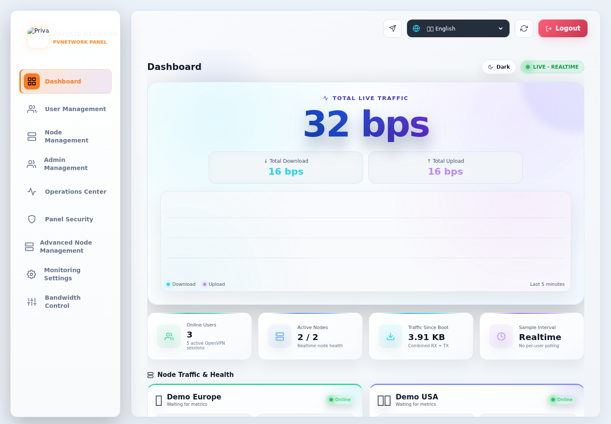

Latest release line: **v1.0.11** — [release notes](./docs/RELEASE-NOTES-v1.0.11.md).

## What changed in v1.0.10 vs v1.0.9

**PVN-030 — backward-compatible migration of PVNetwork-owned protocol aliases.** New API tokens use `pvn_` while existing `ovp_` tokens remain valid. Node callbacks accept the new `X-PVNetwork-Node-Key` and the legacy `X-OV-Node-Key`; conflicting values are rejected. PVNetwork-injected Node helpers move to `_pvnetwork_*` during upgrade, while upstream `ov-node` paths/services and normal OpenVPN remain unchanged.

Latest release line: **v1.0.10** — [release notes](./docs/RELEASE-NOTES-v1.0.10.md).

## What changed in v1.0.9 vs v1.0.8

**PVN-029 — opt-in Router / MikroTik OpenVPN compatibility without changing normal OpenVPN.** Normal users keep the existing certificate-only profile and never need a username/password. A compatible Node can explicitly enable a separate secondary OpenVPN listener with certificate + one-time-generated password authentication, isolated port/subnet/firewall state, and its own Router profile.

The secondary listener reuses the existing client certificate Common Name for identity, so device/session accounting remains tied to the same PVNetwork user. Router credentials are per-user/per-node, plaintext passwords are returned only when generated/rotated and are never persisted, and old Nodes report `upgrade_required` rather than breaking normal OpenVPN actions.

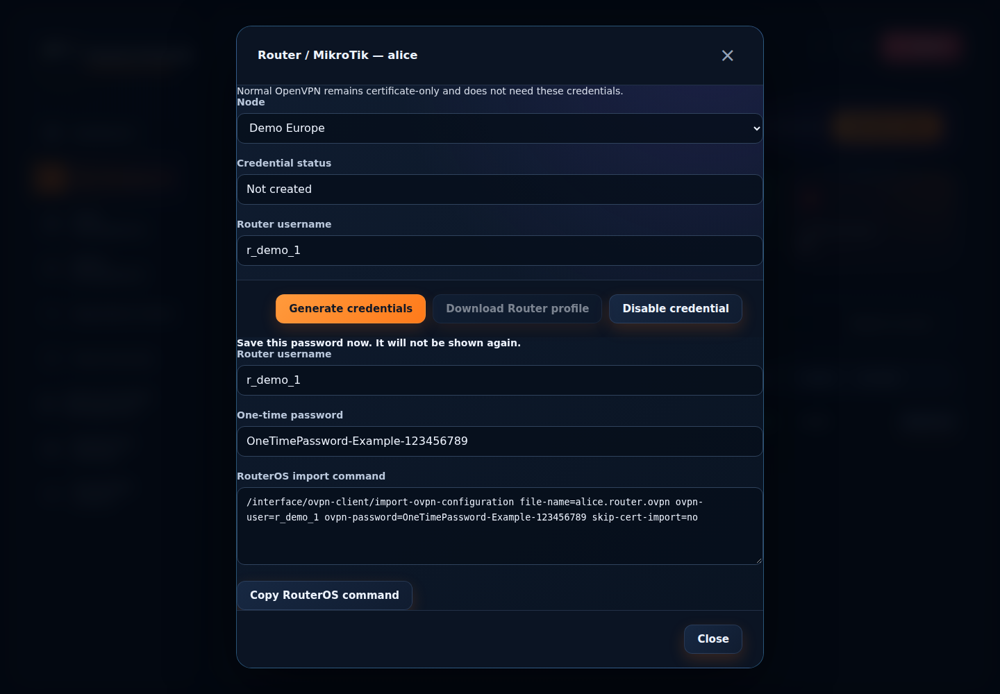

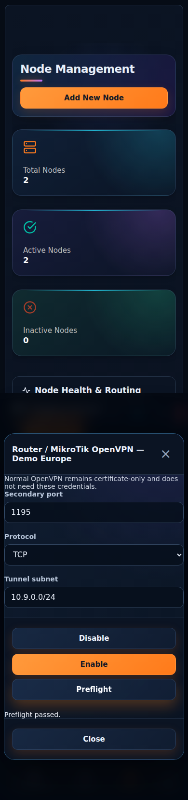

Latest release line: **v1.0.9** — [release notes](./docs/RELEASE-NOTES-v1.0.9.md).

## What changed in v1.0.8 vs v1.0.7

**PVN-028 — Production security hardening without changing default OpenVPN authentication.** Main-admin credentials are migrated to a one-way hash, Production docs/schema exposure follows the DOC switch, login throttling and response security headers are hardened, SSH host keys require explicit verification, dependency/static security scans are CI gates, and the host-firewall rollout is inventory-first with timed rollback. Existing certificate-only OpenVPN profiles remain the default for normal users.

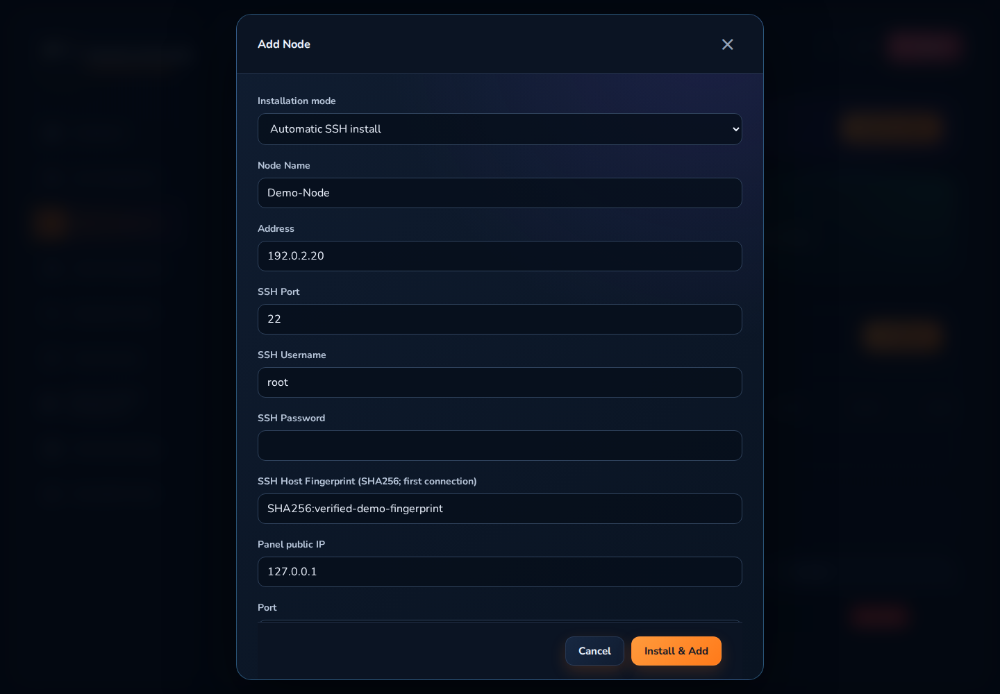

Latest release line: **v1.0.8** — [release notes](./docs/RELEASE-NOTES-v1.0.8.md).

## What changed in v1.0.7 vs v1.0.6

**PVN-031 — synchronize the final online-user display race.**

 Dashboard and User Management now read from one short-lived process-wide presence snapshot. User Management refreshes only the lightweight role-scoped presence map every second instead of waiting up to 10 seconds for a full user-list refresh, while the complete user list refreshes separately at a slower cadence.

This hotfix is display-only: it does not write `active_sessions`, does not alter device-limit enforcement, and does not change OpenVPN profiles or node state. It specifically closes the case where two pages used the same merge logic but still displayed different numbers because their requests landed on adjacent live samples.

Latest release: **v1.0.7** — [release notes](./docs/RELEASE-NOTES-v1.0.7.md).

## What changed in v1.0.6 vs v1.0.5

**PVN-027 — one online-user truth across Dashboard and Users.**


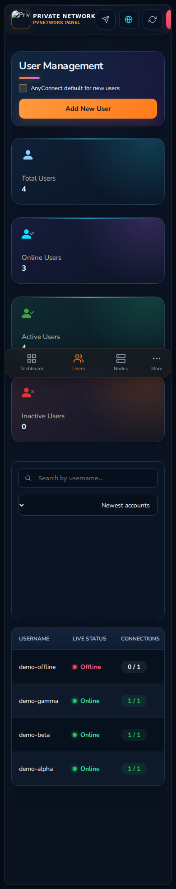 The panel now merges fresh central session heartbeats with a display-only direct-node fallback, deduplicates current PVNetwork users across nodes, and ignores orphan/stale node profiles in the global Online Users total. This fixes the case where a node could report live OpenVPN clients while its session hooks were missing from the central `active_sessions` view.

The fallback never writes enforcement sessions or changes device-limit behavior. Raw node/session metrics remain on node cards, while the global user count and User Management online flags are derived from the same shared user-presence snapshot. Transient node polling failures retain valid central state and a short cached direct snapshot.

Latest release: **v1.0.6** — [release notes](https://github.com/DashSaman/OV-PvNetwork/releases/tag/v1.0.6).

## What changed in v1.0.5 vs v1.0.4

**PVN-026 — choose target nodes while creating a user.** The Add User dialog now lists every known node, selects every currently available node by default, and keeps offline/draining/maintenance nodes visible but disabled. Operators can uncheck any available node before creation; the API persists the chosen assignment before remote provisioning and creates the profile only on the selected nodes.

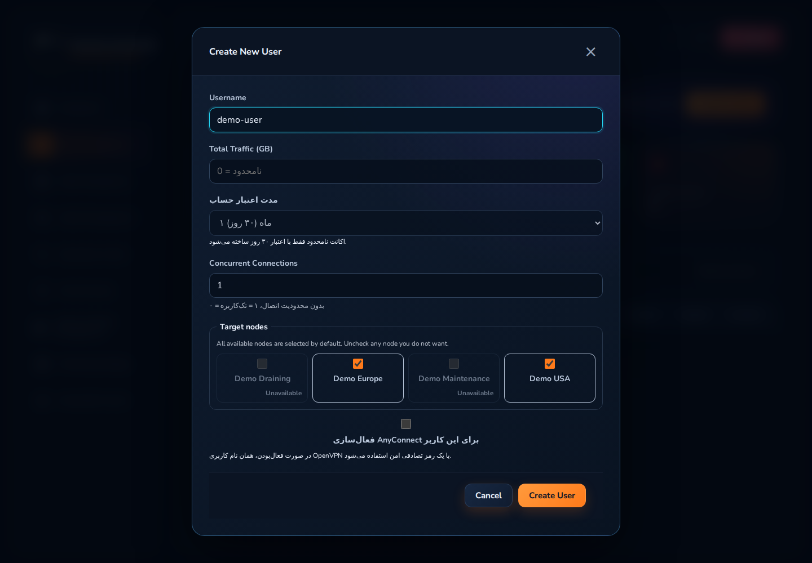

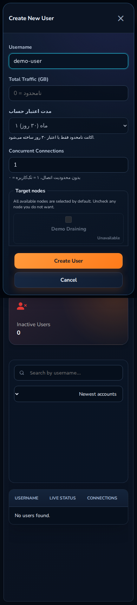

Backward-compatible API calls that omit `node_ids` still resolve to all currently available nodes. Explicit assignments are authoritative: the periodic reconciler can repair missing profiles on selected nodes but cannot silently widen a user's node set. The selector is covered in English/Persian at phone, tablet and desktop widths.

Previous release: **v1.0.5** — [release notes](https://github.com/DashSaman/OV-PvNetwork/releases/tag/v1.0.5).

## What changed in v1.0.4 vs v1.0.3

**PVN-025 — PVNetwork brand purity and runtime ownership.** The tracked project now uses PVNetwork-owned application, service, package, storage and backup identifiers throughout. A blocking test scans every tracked text/path so the former upstream panel product identifier cannot return. Runtime naming is standardized on `/opt/pvnetwork-panel` and `pvnetwork-panel.service`, with safe compatibility for existing SQLite data and browser language preference.

The release also aligns API/package/frontend/release version metadata on **1.0.4** and changes installer/update resolution to the maintained `DashSaman/OV-PvNetwork` releases. Production migration is backup-first and uses a parallel local canary plus atomic proxy switch before retiring the previous runtime.

Previous release: **v1.0.4** — [release notes](https://github.com/DashSaman/OV-PvNetwork/releases/tag/v1.0.4).

## What changed in v1.0.3 vs v1.0.2

**PVN-205 — inline user quick edit.** The Users page now expands a safe quick editor from the row actions. Traffic limit, expiry (where policy allows), concurrent-device limit, active state, assigned nodes and an optional Reset Usage can be reviewed and applied without opening the full Edit modal. Username is intentionally read-only until the separate safe multi-node rename task (`PVN-022`) is implemented.

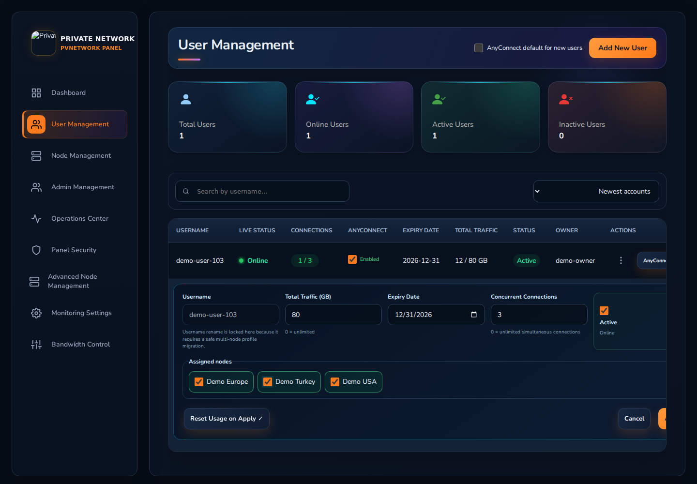

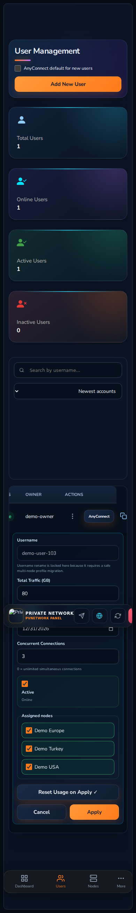

Node assignment changes are safety-gated: removed assignments are deactivated instead of deleting certificates, stale disabled profiles are reused where possible, and a newly selected unavailable node is rejected before mutation. Status/update synchronization is assignment-aware. Browser verification covers English LTR and Persian RTL on phone/tablet/desktop widths.

Previous release: **v1.0.3** — [release notes](https://github.com/DashSaman/OV-PvNetwork/releases/tag/v1.0.3).

PVNetwork Panel is the independently maintained PVNetwork control plane for multi-node OpenVPN operations, renewal, AnyConnect integration, monitoring, security controls, backup/restore, health scoring, traffic controls and safer deployment tooling.

> **Production safety is a project rule:** deployments are assumed live and under load. Changes use backup/check → narrow mutation → smallest necessary restart → health verification → rollback readiness. Public repository content is sanitized and must not contain live users, infrastructure identifiers or secrets.

## Visual tour

### Dashboard, users and nodes


### Administration, operations and security


### Advanced fleet, monitoring and bandwidth controls


### v1.0.2 Subscription mobile proof

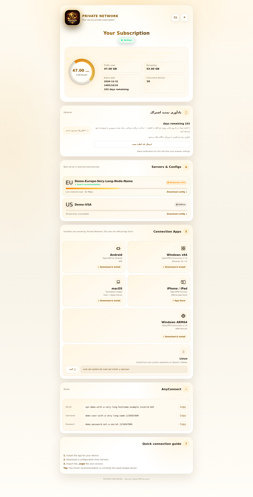

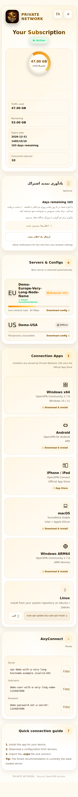

v1.0.2 hardens the public Subscription page for small touch screens: notification, Linux-copy and AnyConnect-copy controls meet the mobile touch floor, long demo usernames/hosts wrap safely, and FA RTL / EN LTR remain overflow-safe.

### v1.0.1 desktop / mobile proof

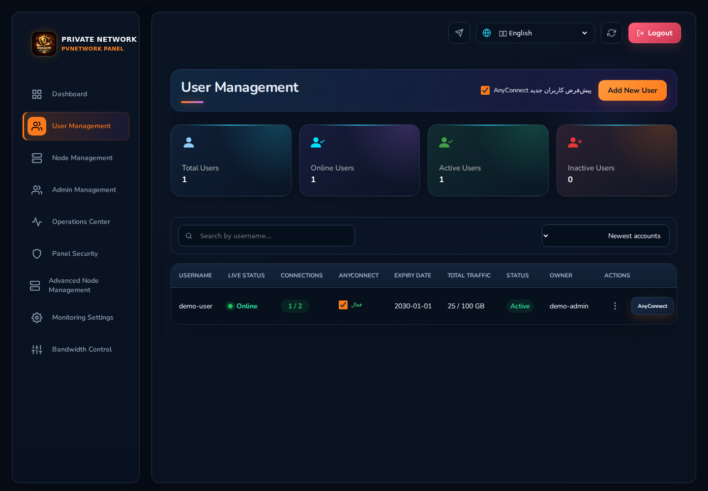


Detailed illustrated documentation:

- [Complete English UI guide](./docs/UI-GUIDE.md)
- [v1.0.1 Responsive & accessibility guide](./docs/RESPONSIVE-GUIDE.md)
- [راهنمای کامل فارسی رابط کاربری](./docs/UI-GUIDE.fa.md)
- [راهنمای فارسی Responsive و Accessibility](./docs/RESPONSIVE-GUIDE.fa.md)

## Core capabilities

| Area | Included |
|---|---|
| Users | Create with per-node selection, full edit, inline quick edit, safe multi-node username rename, activate/deactivate, delete, renewal, usage reset, node assignment, profile/subscription delivery |
| Renewal | Expired-user renewal, unlimited renewal, finite preserve/reset/add-traffic modes |
| AnyConnect | Per-user enable/disable, password generation/change, shared user identity |
| Multi-node | Node CRUD, health view, user assignment, safe node lifecycle |
| Fleet | Health score, maintenance, drain/resume, controlled upgrade/retry workflows |
| Monitoring | Realtime traffic dashboard, node CPU/RAM/uptime, Telegram monitoring plus explicit Node DOWN/UP transition alerts |
| Security | IP allowlist, rate limiting, TOTP 2FA, scoped/expiring API tokens |
| Operations | Bulk user actions, transfer/rebalance tools, usage history, audit/operational views |
| Bandwidth | Emergency off, policy preview/canary/activate, groups and per-node status |
| Backup | Verified manual backup download and guarded restore workflow |
| Integrations | Mirza integration API, OpenVPN node API, optional AnyConnect/ocserv hooks |
| v1.0.1 UX | Full mobile Main Admin navigation, viewport-safe dialogs, touch/focus/reduced-motion hardening, RTL/LTR responsive browser smoke matrix |

## v1.0.1 responsive behavior

Main Admin routes remain reachable on phones through Dashboard, Users, Nodes and a **More** menu containing Admins, Operations, Security, Fleet, Monitoring and Bandwidth. Shared CSS hardening keeps primary touch targets usable, dialogs inside the dynamic viewport, tables bounded to their own scroll region and long translated text able to reflow.

CI checks the major routes at `360`, `375`, `390`, `430`, `768`, `1024`, `1366`, `1440` and `1920` px in English LTR and Persian RTL. See [UX Audit](./docs/UX-AUDIT.md) and [Release QA Gate](./docs/QA-RELEASE-GATE.md).

## Quick installation

Run on a **fresh** supported server as `root`:

```bash
bash <(curl -fsSL https://raw.githubusercontent.com/DashSaman/OV-PvNetwork/v1.0.28/install.sh)
```

The installer uses the tagged release source instead of following an unpinned development branch.

After installation, use the lifecycle manager where supported by the deployment:

```bash
pvnetwork status
pvnetwork doctor
pvnetwork version
pvnetwork backup
pvnetwork update
pvnetwork rollback
```

For a production server that already has a legacy panel deployment or other services, do **not** run the fresh installer blindly. Review the update/migration path, create a backup and verify the current service health first.

Documentation:

- [Installation](./docs/INSTALLATION.md)
- [Architecture](./docs/ARCHITECTURE.md)
- [Updates and rollback](./docs/UPDATES.md)
- [Renewal behavior](./docs/RENEWAL.md)
- [Feature matrix](./docs/FEATURE-MATRIX.md)
- [Competitor gap matrix](./docs/COMPETITOR-GAP-MATRIX.md)
- [Numbered capability backlog](./docs/FEATURE-BACKLOG.md)
- [Roadmap](./ROADMAP.md)

## Architecture

```text
                         ┌──────────────────────────────┐
                         │       PVNetwork Panel       │
                         │       Panel / API / UI      │
                         └──────────────┬───────────────┘
                                        │
                    assignment / health / metrics / profile API
                                        │
             ┌──────────────────────────┼──────────────────────────┐
             │                          │                          │
      ┌──────▼──────┐            ┌──────▼──────┐            ┌──────▼──────┐
      │  OV-Node A  │            │  OV-Node B  │     ...    │  OV-Node N  │
      │  OpenVPN    │            │  OpenVPN    │            │  OpenVPN    │
      └─────────────┘            └─────────────┘            └─────────────┘

 Optional integrations:
 AnyConnect / ocserv · Mirza · Telegram · monitoring · bandwidth policies
```

## Requirements

| Component | Minimum | Recommended |
|---|---:|---:|
| Panel | 1 vCPU / 1 GB RAM / 10 GB | 2 vCPU / 2 GB RAM / 20 GB SSD |
| VPN node | 1 vCPU / 512 MB RAM / 5 GB | 1–2 vCPU / 1 GB+ RAM / 10 GB |

Supported installer targets: Ubuntu 22.04 LTS, Ubuntu 24.04 LTS and Debian 12 (best-effort where upstream package differences apply).

## Production-safe lifecycle

1. Verify the current deployment and service health.
2. Create a backup before an update.
3. Apply only the target release and reviewed migrations.
4. Build and run automated checks.
5. Restart only the required control-plane service.
6. Verify local/public health and critical workflows.
7. Roll back immediately when verification fails.

Node-side automation must not flush firewall rules, replace default routes or remove unrelated services/tunnels simply to simplify deployment.

## Project governance

`AGENTS.md` is the persistent execution contract. Every applicable backlog item receives a stable `PVN-xxx` ID. The detailed registry covers UI/UX, user lifecycle, devices, node/fleet operations, observability, enterprise identity, automation, optional Xray/WireGuard protocol work, installer/HA/DR hardening and migration/client compatibility.

A task is not marked done merely because code exists; tests, build/compile, responsive/accessibility checks, repository sanitization and applicable Production health verification must pass first.

## Release policy

- `v1.0.0` remains the immutable stable baseline.
- `v1.0.1` adds compatible UX/responsive/governance hardening.
- Patch releases are backwards-compatible fixes.
- Minor releases add backwards-compatible capabilities.
- Major releases may contain breaking architecture/protocol changes.
- Production-visible changes must be documented in `CHANGELOG.md` and shipped through a tagged GitHub Release.

## Security

Never commit `.env`, databases, API/JWT secrets, SSH credentials, private keys, TLS material, client `.ovpn` profiles or real production screenshots. The public documentation uses sanitized demo values only.

See [SECURITY.md](./SECURITY.md) for reporting and deployment guidance.

## Credits

PVNetwork includes modifications derived from an MIT-licensed panel foundation and interoperates with the `primeZdev/ov-node` node component. Required attribution is preserved in [NOTICE.md](./NOTICE.md) and [LICENSE](./LICENSE).
