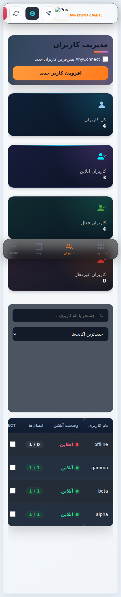

# PVNetwork Panel v1.0.11 — اصلاح مرجع واقعی کاربران آنلاین

**Patch task:** `PVN-033`

این Patch اختلاف باقی‌مانده در Production را با شواهد واقعی Node/Session بازتولید می‌کند و بدون تغییر Enforcement مربوط به OpenVPN، دو ایراد نمایش Presence را رفع می‌کند.

## چه چیزی تغییر کرد
- پاسخ موفق `/sync/usage` با `data: null` اکنون یک Sample تازه با صفر Client محسوب می‌شود، نه Poll ناموفق؛ بنابراین کاربری که قطع شده دیگر به‌خاطر stale-grace برای مدتی آنلاین باقی نمی‌ماند.
- Snapshot مشترک Presence حالا تعداد Userهای مدیریت‌شده را به تفکیک Node هم می‌دهد. Node Cardهای Dashboard از همین Mapping استفاده می‌کنند و با Online Users کلی و User Management یک مرجع واحد دارند.
- Common Nameهای ناشناخته/یتیم در تعداد Userهای مدیریت‌شده وارد نمی‌شوند و جداگانه به‌عنوان Drift تشخیصی گزارش می‌شوند.

## شواهد Production
در Fleet واقعی، Nodeهای بدون Client پاسخ HTTP 200 با `data: null` می‌دادند ولی کد قبلی آن را Failure حساب می‌کرد. همچنین روی USA یک Common Name زنده دیده شد که Username پایه‌اش دیگر در دیتابیس پنل وجود نداشت. این اتصال در عدد Userهای مدیریت‌شده شمرده نمی‌شود و این Patch نمایشی آن را به‌صورت مخرب revoke نمی‌کند.

## ایمنی
- Fallback نمایشی چیزی در `active_sessions` نمی‌نویسد.
- منطق Device Limit و acquire/heartbeat/release تغییر نمی‌کند.
- Migration دیتابیس ندارد.
- Listener/Profile/Certificate مربوط به OpenVPN تغییر نمی‌کند.
- برای این تغییر نیازی به Restart کردن Node یا OpenVPN نیست.
