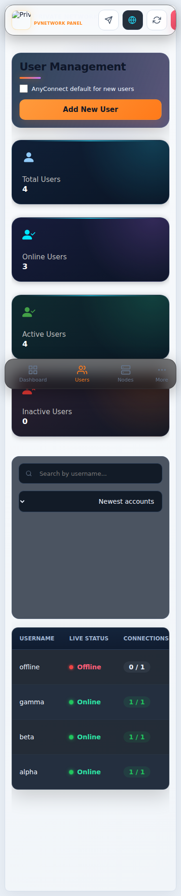

# PVNetwork Panel v1.0.11 — Live Online-Count Truth Fix

**Patch task:** `PVN-033`

This patch reproduces the remaining Production mismatch from live Node/session evidence and fixes two display-truth gaps without changing OpenVPN enforcement.

## What changed
- A successful Node `/sync/usage` response with `data: null` is now a fresh zero-client sample, not a failed poll. This prevents a recently disconnected user from remaining visible during the stale-grace window.
- The shared presence snapshot now exposes managed online-user counts per Node. Dashboard Node cards use these mapped counts, matching the same PVNetwork users represented by the global Online Users total and User Management.
- Unknown/orphan Common Names are excluded from managed totals and reported separately as diagnostic drift instead of being silently mixed into panel-user counts.

## Production evidence behind the fix
The live fleet showed zero-client Nodes returning HTTP 200 with `data: null`; the old code treated those successful samples as failures. A separate live USA connection also had a Common Name whose base username no longer existed in the panel database. The latter remains excluded from managed-user truth and is not destructively revoked by this display patch.

## Safety
- No writes to `active_sessions` from the display fallback.
- Device-limit acquire/heartbeat/release behavior is unchanged.
- No database migration.
- No OpenVPN listener/profile/certificate mutation.
- No Node/OpenVPN restart is required for the behavior change.
