

# راهنمای تصویری Responsive و دسترسی‌پذیری PVNetwork v1.0.1

این راهنما مکمل [راهنمای کامل تصویری پنل](./UI-GUIDE.fa.md) است و توضیح می‌دهد منوها، جدول‌ها، Modalها و عملیات مدیریتی در دسکتاپ، تبلت و موبایل چگونه باید استفاده شوند.

> تصاویر مخزن با داده Demo/Sanitized منتشر می‌شوند. اطلاعات Production، کاربر واقعی، IP، Domain، UUID، Secret و Credential نباید در Screenshot عمومی قرار گیرد.

## نمای کلی پنل

**دسکتاپ**

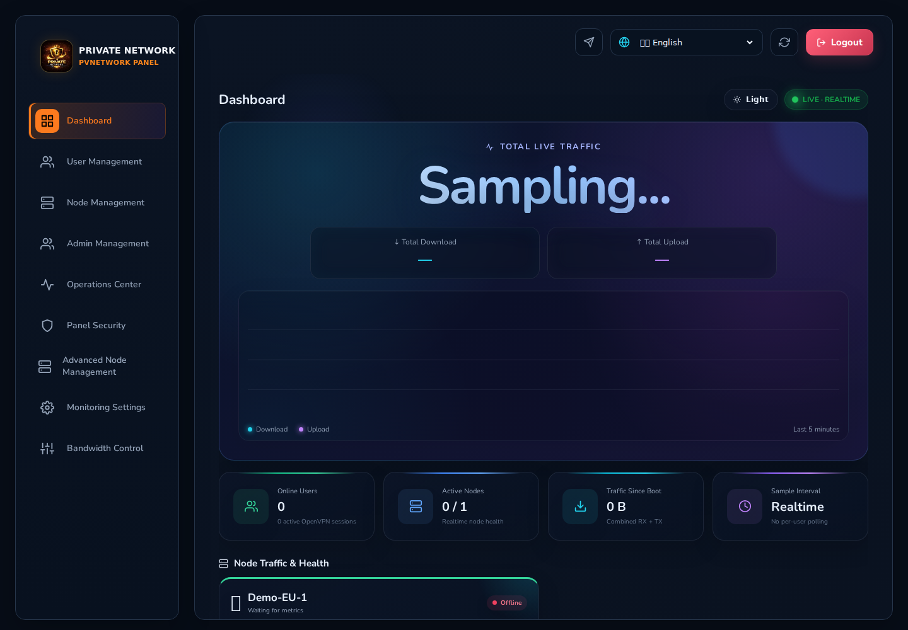

**موبایل**

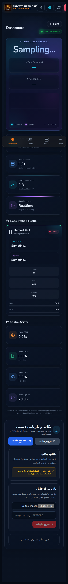

در نسخه v1.0.1 چیدمان عمومی برای عرض‌های 360 تا 1920 پیکسل سخت‌گیری بیشتری دارد: متن باید بدون بریدگی Reflow شود، صفحه نباید Horizontal Scroll ناخواسته داشته باشد و کنترل‌های اصلی برای Touch حداقل حدود 44×44 پیکسل باشند.

## کاربران و عملیات روزمره

**دسکتاپ**

**موبایل**

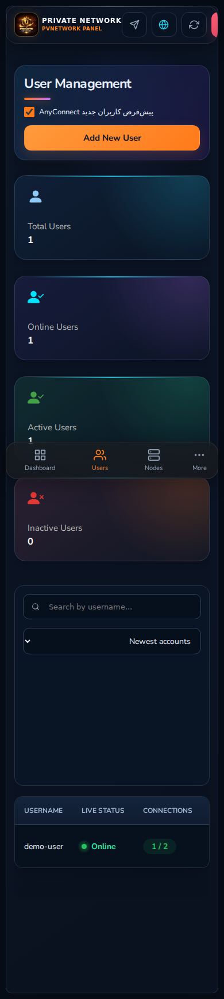

در موبایل اولویت با دسترسی به Search، Sort، Pagination و منوی عملیات هر کاربر است. جدول می‌تواند داخل محدوده خودش Scroll شود، اما خود صفحه نباید به خاطر جدول از Viewport بیرون بزند.

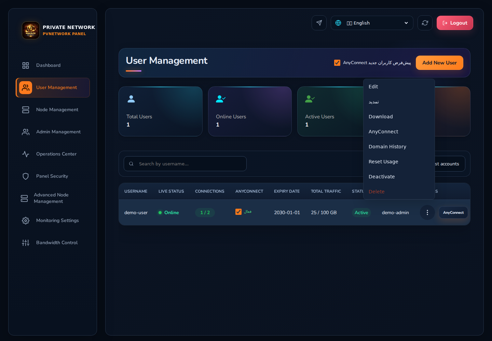

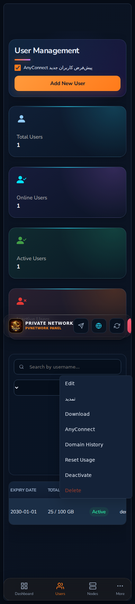

منوی سه‌نقطه اکنون Semantic Menu دارد، با Keyboard قابل دسترسی است، با `Escape` بسته می‌شود و در لبه‌های صفحه داخل Viewport باقی می‌ماند.

## تمدید کاربر

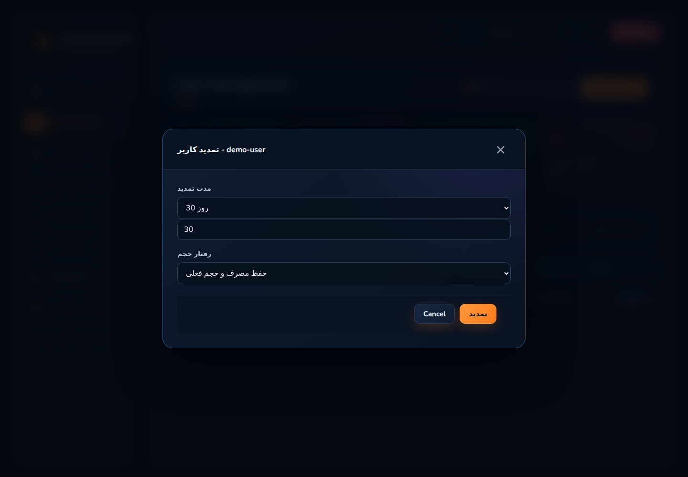

Modal تمدید در Viewport کوتاه به‌صورت داخلی Scroll می‌شود و Header/Footer عملیات قابل دسترسی باقی می‌مانند. همان UUID/Username حفظ می‌شود و این تغییر فقط UX را سخت‌گیرانه‌تر می‌کند؛ منطق Renewal نسخه 1.0 تغییر داده نمی‌شود.

## AnyConnect

Credentialها و دکمه‌های Copy/Change/Enable باید روی موبایل نیز قابل لمس و قابل خواندن باشند. داده امنیتی واقعی در مستندات عمومی نمایش داده نمی‌شود.

## نودها

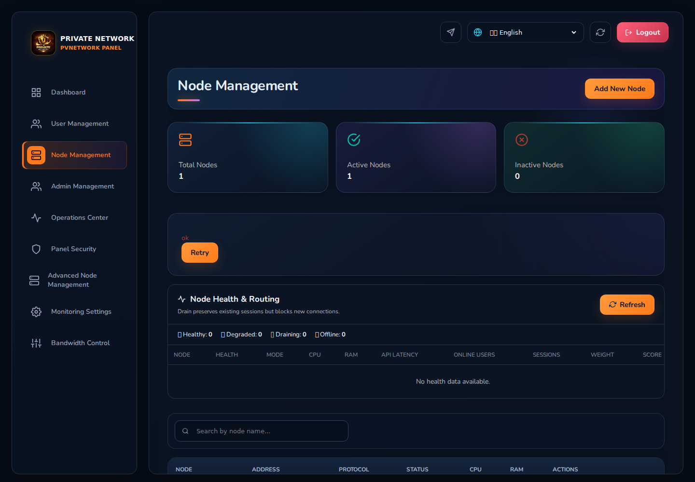

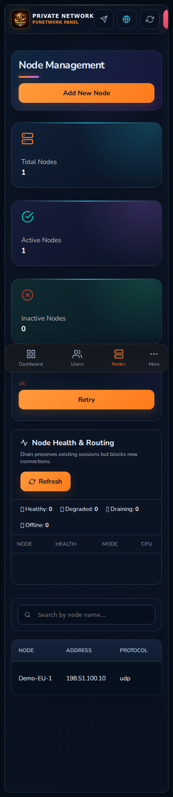

در صفحه Node، وضعیت Health و عملیات Add/Edit/Download باید در موبایل هم قابل دسترس بماند. هیچ Hardening رابط کاربری اجازه ندارد Firewall، Default Route، Tunnel یا سرویس نامرتبط نود Production را تغییر دهد.

فرم افزودن نود در صفحه کوچک به‌جای فشرده‌سازی بیش از حد، Fieldها را Stack می‌کند و Deploy progress باید قابل مشاهده بماند.

## منوی موبایل Main Admin

در موبایل چهار مقصد اصلی پایین صفحه ثابت می‌مانند و بخش‌های مدیریتی بیشتر از طریق **More** قابل دسترسی هستند:

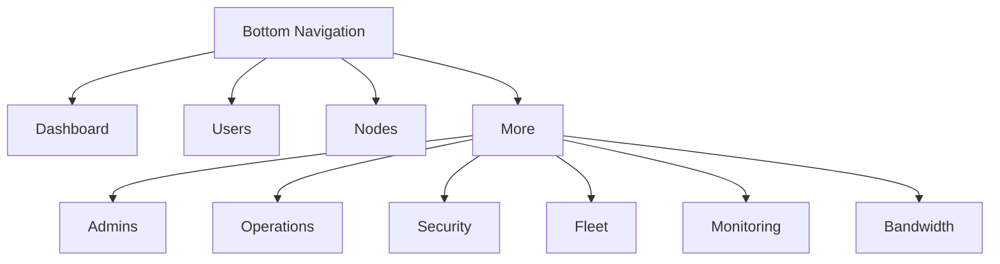

بنابراین هیچ بخش اصلی Main Admin فقط به Sidebar دسکتاپ وابسته نیست.

## Operations و Backup/Restore

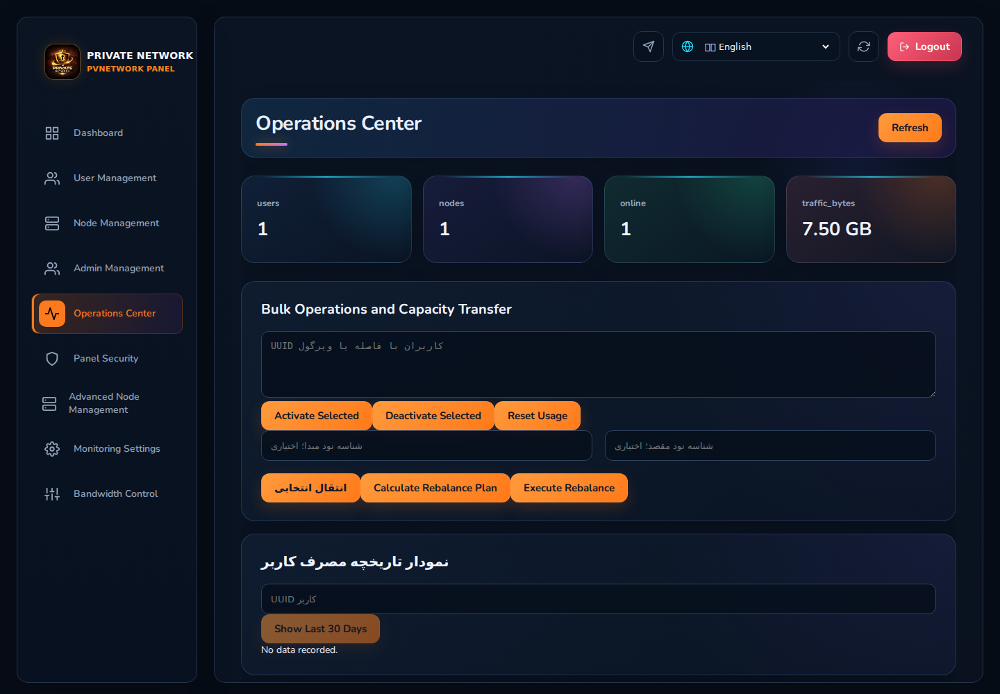

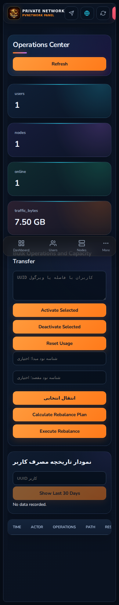

Bulk action، Transfer، Rebalance، Usage History و Audit باید در صفحه کوچک بدون پنهان‌شدن دکمه‌ها قابل استفاده باشند. Restore همچنان عملیات حساس است و نیاز به تأیید صریح دارد.

## Security

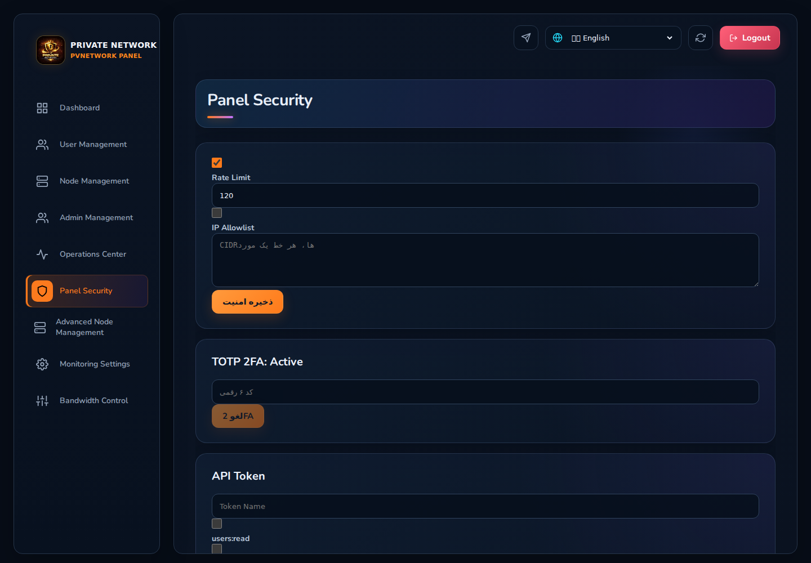

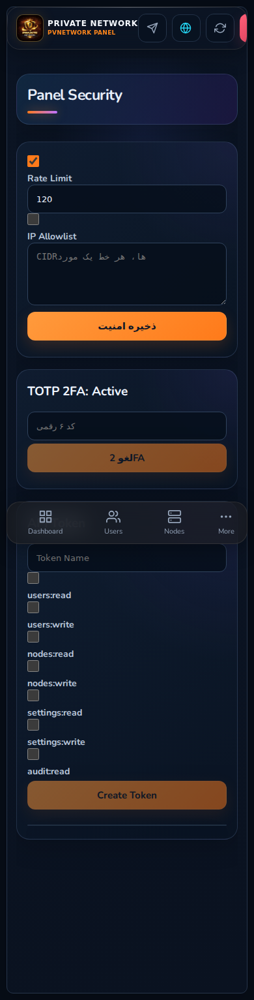

TOTP، IP Allowlist، Rate Limit و API Tokenها در موبایل باید قابل استفاده باشند. Focus کیبورد قابل مشاهده است و Controlهای Icon-only باید Accessible Name داشته باشند.

## Fleet

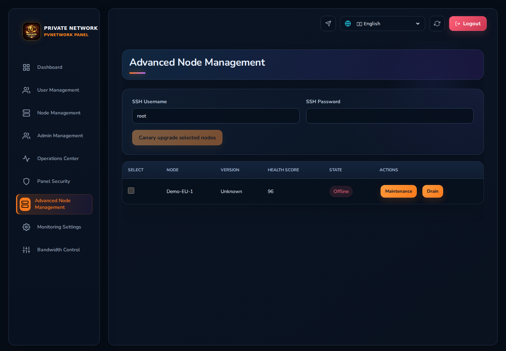

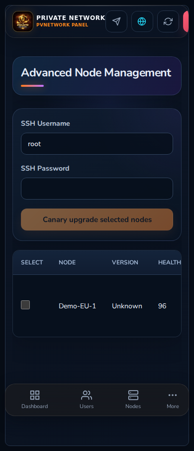

Maintenance، Drain/Resume و Upgrade عملیات حساس‌اند. دکمه‌ها در عرض کم Wrap/Stack می‌شوند ولی معنی و ترتیبشان تغییر نمی‌کند.

## Monitoring

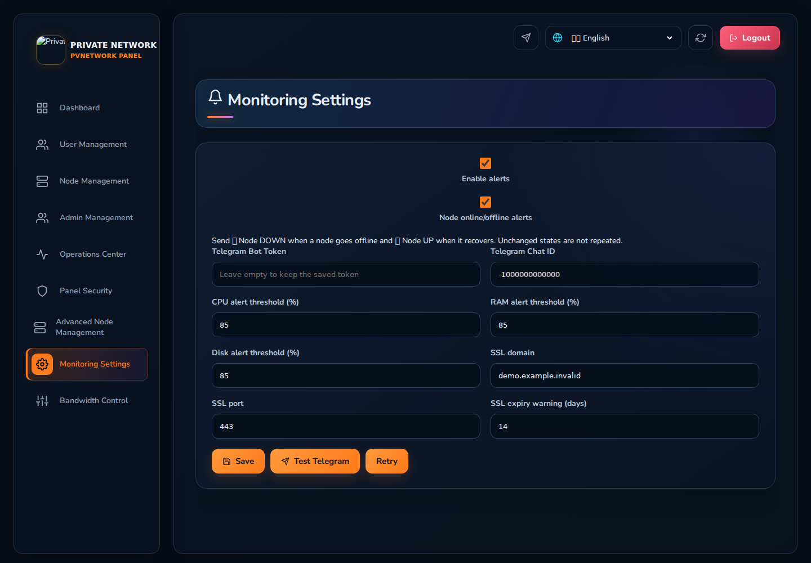

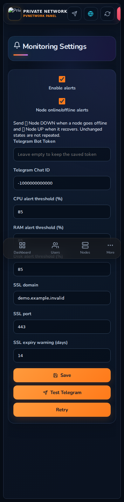

تنظیم Alert و Test Telegram در عرض کم به یک ستون تبدیل می‌شود. Loading/Error/Retry باید مشخص باشد و Long label نباید باعث بریدگی Form شود.
هشدار اتصال نودها در Monitoring یک سوییچ جدا دارد. فقط هنگام تغییر وضعیت، پیام `Node DOWN` برای قطع و `Node UP` برای وصل مجدد ارسال می‌شود و تا وقتی وضعیت ثابت است پیام تکراری نمی‌آید.

## Bandwidth Control

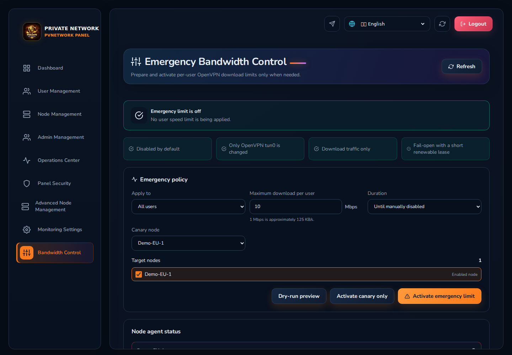

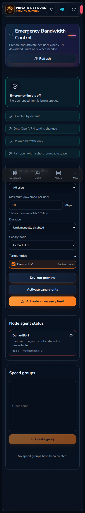

Preview، Canary، Activate و Emergency Off عمداً از نظر معنایی از هم جدا هستند. در موبایل Actionها Full-width می‌شوند تا اشتباه Touch کمتر شود و Group/User/Node pickerها داخل Viewport باقی بمانند.

## ماتریس تست Release

قبل از Release رسمی، مسیرهای اصلی روی عرض‌های `360`, `375`, `390`, `430`, `768`, `1024`, `1366`, `1440`, `1920` تست می‌شوند. علاوه بر آن، جریان‌های اصلی با Keyboard و Touch و حالت‌های RTL/LTR بررسی می‌شوند.

CI نسخه v1.0.1 یک Browser Smoke Matrix با Chromium اجرا می‌کند و برای تمام Routeهای اصلی Horizontal Overflow و خطای Runtime را بررسی می‌کند. این تست جای بررسی Production را نمی‌گیرد؛ Deployment واقعی فقط بعد از Backup و Health Check انجام می‌شود.

## Workflow امن Release

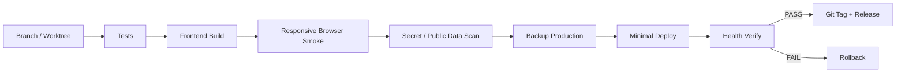

## Keyboard و Accessibility

- `Tab` باید به تمام Actionهای اصلی برسد.
- Focus با Outline واضح دیده می‌شود.
- `Escape` منوی عملیات باز را می‌بندد.
- Animationهای غیرضروری با `prefers-reduced-motion` تقریباً حذف می‌شوند.
- Status فقط با رنگ منتقل نمی‌شود.
- Actionهای حساس باید Confirmation و Feedback واضح داشته باشند.

## مسیرهای مرتبط

- [راهنمای تصویری کامل فارسی](./UI-GUIDE.fa.md)
- [قوانین QA Release](./QA-RELEASE-GATE.md)
- [UX Audit](./UX-AUDIT.md)
- [Feature Backlog شماره‌دار](./FEATURE-BACKLOG.md)
- [English responsive guide](./RESPONSIVE-GUIDE.md)

