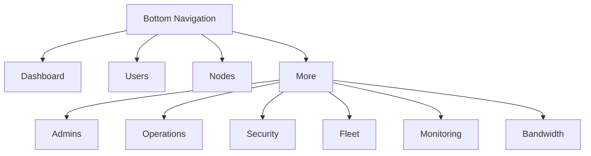
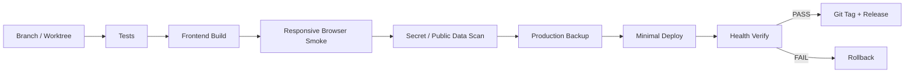

# PVNetwork v1.1 Responsive & Accessibility Guide

This document complements the [complete illustrated UI guide](./UI-GUIDE.md) and explains how navigation, tables, dialogs and administrative workflows are expected to behave on desktop, tablet and mobile.

> Public screenshots use demo/sanitized data only. Production users, IPs, domains, UUIDs, secrets and credentials must never be exposed in repository imagery.

## Panel overview

v1.1 strengthens the shared layout from 360 to 1920 px: essential text must reflow instead of clipping, page-level horizontal overflow is blocked, and primary touch targets aim for at least 44×44 px.

## Users and daily actions

On phones, Search, Sort, Pagination and per-user actions stay reachable. Data tables may scroll inside their own container when the data is inherently tabular, but they must not push the whole page outside the viewport.

The three-dot action control now exposes proper menu semantics, is keyboard operable, closes with `Escape`, returns focus to the trigger and is repositioned to remain inside viewport edges.

## User renewal

The renewal dialog is viewport-bounded and internally scrollable on short screens. Header/footer controls remain reachable. The UX hardening does not alter the v1.0 renewal identity guarantees: UUID, username and existing assignments are preserved.

## AnyConnect

Credentials and Copy/Change/Enable controls remain readable and touchable on narrow screens. Real security material is never included in public documentation.

## Nodes

Node health and Add/Edit/Download actions remain reachable on mobile. UI hardening must never justify changing a Production node's firewall, default route, tunnels or unrelated services.

On narrow screens the Add Node flow stacks fields rather than compressing them beyond usability, while deploy progress remains visible.

## Main Admin mobile navigation

The bottom navigation keeps core destinations visible and moves the remaining administrative routes into a clear **More** menu:

No main administrative section is therefore available only from the desktop sidebar.

## Operations and Backup/Restore

Bulk actions, Transfer, Rebalance, Usage History and Audit stay reachable on smaller viewports. Restore remains a guarded destructive workflow requiring explicit confirmation.

## Security

TOTP, IP Allowlist, Rate Limit and scoped API Tokens remain usable on mobile. Keyboard focus is visible, and icon-only controls are required to expose accessible names.

## Fleet

Maintenance, Drain/Resume and Upgrade are sensitive operations. Their action groups wrap or stack at narrow widths without changing their meaning or safety semantics.

## Monitoring

Alert settings and Telegram test controls collapse to a readable single-column layout as needed. Loading, failure and Retry states remain explicit.

## Bandwidth Control

Preview, Canary, Activate and Emergency Off are intentionally distinct operations. On phones the action area expands for touch safety, while group/user/node pickers remain bounded inside the viewport.

## Release viewport matrix

Before an official release, the main routes are checked at `360`, `375`, `390`, `430`, `768`, `1024`, `1366`, `1440` and `1920` px. Core workflows are additionally reviewed for keyboard/touch operation and RTL/LTR behavior.

v1.1 CI runs a Chromium browser smoke matrix across all major routes and checks for page-level horizontal overflow and runtime errors. Browser CI complements rather than replaces Production validation; a live deployment still requires backup and health verification.

## Safe release workflow

## Keyboard and accessibility behavior

- `Tab` reaches primary actions.
- Focus is shown with a visible outline.
- `Escape` closes an open row-actions menu.
- Non-essential motion is nearly removed under `prefers-reduced-motion`.
- Status meaning should not depend on color alone.
- Sensitive actions require clear confirmation and mutation feedback.

## Related documents

- [Complete English UI guide](./UI-GUIDE.md)
- [Release QA gate](./QA-RELEASE-GATE.md)
- [UX audit](./UX-AUDIT.md)
- [Numbered feature backlog](./FEATURE-BACKLOG.md)
- [راهنمای فارسی](./RESPONSIVE-GUIDE.fa.md)
