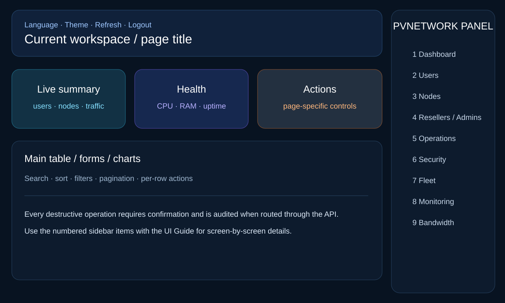
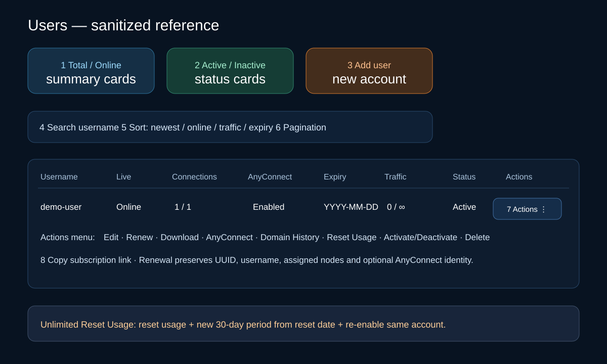
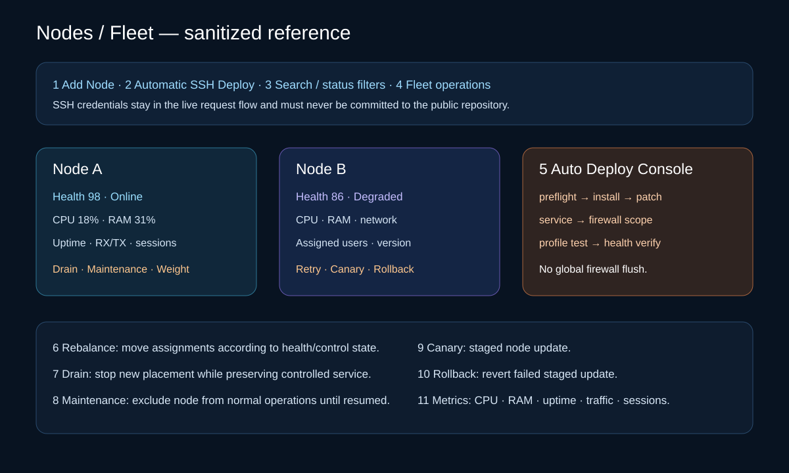
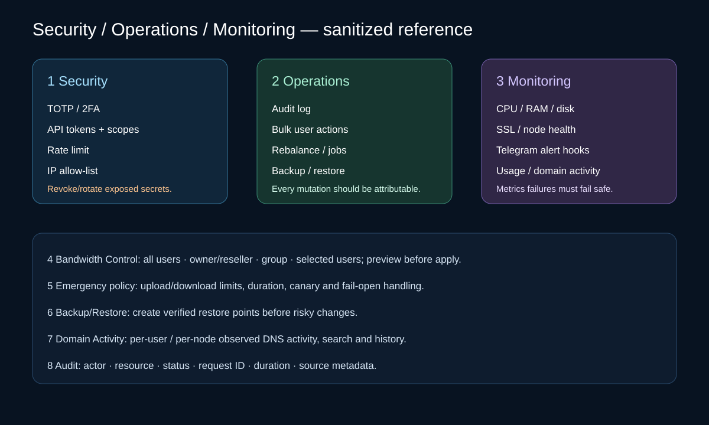

# راهنمای مصور رابط کاربری

تمام تصاویر این راهنمای عمومی با اطلاعات ساختگی ساخته شده‌اند و هیچ User، IP، Domain یا Credential واقعی Production داخل آن‌ها نیست.

## ۱. داشبورد

داشبورد خلاصه وضعیت Userها، Nodeها و سلامت سرویس را نمایش می‌دهد. کنترل Language/Theme برای ظاهر، Refresh برای بارگذاری فوری داده و Logout برای خروج است. Cardهای Node در صورت موجود بودن CPU، RAM، Uptime، Network Rate/Traffic و Online Session را نشان می‌دهند.

## ۲. مدیریت کاربران

این صفحه Search، Sort، Pagination و Cardهای خلاصه کاربران را دارد. منوی عملیات هر User شامل **ویرایش، تمدید، دانلود، AnyConnect، Domain History** برای Role مجاز، **بازنشانی مصرف، فعال/غیرفعال و حذف** در صورت مجاز بودن Policy است. آیکن Copy لینک ثابت Subscription همان User را کپی می‌کند.

**تمدید** همان User را نگه می‌دارد و UUID، Username، Node Assignment، لینک Subscription و هویت AnyConnect را عوض نمی‌کند. در پلن حجمی می‌توان مصرف را حفظ کرد، Reset کرد یا حجم اضافه کرد. در نامحدود فقط دوره زمانی تمدید می‌شود.

**بازنشانی مصرف** برای پلن حجمی فقط مصرف Shared را صفر می‌کند و تاریخ را تغییر نمی‌دهد. برای پلن نامحدود مصرف صفر می‌شود، از تاریخ Reset یک دوره جدید ۳۰ روزه شروع می‌شود و همان User روی Nodeهای اختصاص‌یافته دوباره فعال می‌شود.

## ۳. مدیریت نودها و Fleet

**افزودن نود** Auto Deploy با SSH دارد و Console مرحله‌به‌مرحله Progress و Verify را نمایش می‌دهد. عملیات مدیریتی شامل Health، Drain، Resume، Maintenance، Weight و foundation مربوط به Retry/Canary/Rollback است. Rebalance با توجه به Health/Control State Assignmentها را جابه‌جا می‌کند.

حذف Node یک عملیات حساس به Assignment است و نباید باعث Flush کامل Firewall یا تغییر کورکورانه Routeهای نامرتبط روی Server مقصد شود.

## ۴. مدیریت Admin / Reseller

Main Admin می‌تواند Admin/Reseller، سهمیه حجمی و سهمیه اکانت نامحدود را مدیریت کند. عملیات نماینده به Owner و Quota خودش محدود می‌شود و تغییرات Credit در Ledger ثبت می‌شوند.

## ۵. مرکز عملیات

Operations Center برای Audit/Event و عملیات گروهی استفاده می‌شود. نتیجه Jobها، خلاصه مصرف/اکانت و عملیات Cross-node از این بخش قابل بررسی است. عملیات Bulk باید Confirmation داشته باشد و بعد از اجرا Health/Consistency بررسی شود.

## ۶. امنیت پنل

کنترل‌های امنیتی شامل TOTP/2FA، API Token با Scope، Expiry/Revoke Token، Rate Limit و IP Allow-list است. Secretهای واقعی فقط باید در State خصوصی Deployment بمانند و Credential مشکوک به افشا باید Rotate شود.

## ۷. مدیریت پیشرفته Node / Fleet

Fleet شامل Health Score، Control State، عملیات Staged/Canary و Rollback foundation است. **Drain** Node را از Placement عادی خارج می‌کند تا انتقال کنترل‌شده انجام شود؛ **Maintenance** Node را تا Resume صریح از عملیات عادی خارج نگه می‌دارد.

## ۸. Monitoring

Monitoring شامل Alertهای Resource/Service نودها و Hookهای Telegram است. Metricهای جانبی Fail-safe هستند؛ خراب شدن Parser یا Metric اختیاری نباید Health endpoint اصلی Node را Down کند.

## ۹. کنترل Bandwidth

Policy می‌تواند روی همه کاربران، یک Owner/Reseller، Group ذخیره‌شده یا Userهای انتخابی اعمال شود. قبل از Apply باید Target Set را Preview کرد. Emergency Policy می‌تواند Duration، Canary، Fail-open و مسیر Rollback داشته باشد.

## صفحه Subscription

Subscription Page وضعیت Account، مصرف و باقیمانده، Expiry، Device Limit، Server/Profileهای فعال، Smart Recommendation، دانلود Client، اطلاعات AnyConnect در صورت فعال بودن و Web Push تمدید را نمایش می‌دهد. فایل OpenVPN قبل از تحویل Validate می‌شود و اگر فایل قبلی ناقص/خراب باشد در صورت نیاز Rebuild می‌شود.

## Backup / Restore

قبل از تغییر پرریسک Production باید Backup ساخته شود. Restore مسیر Recovery است و جای Migration/Test صحیح Release را نمی‌گیرد.

