# PVNetwork v1.0.0 — Visual UI Guide

This guide documents the main pages, controls and operator workflows in the v1.0.0 panel.

> Every screenshot is sanitized for public documentation. Real user and infrastructure data is not shown.

## 1. Dashboard

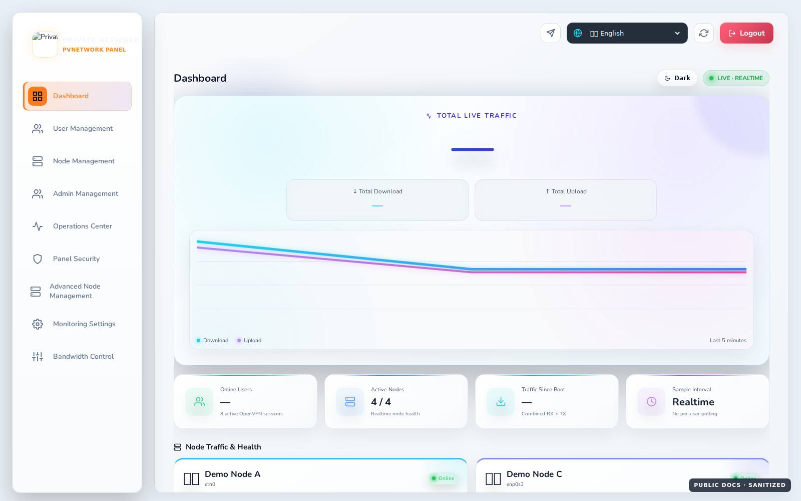

The dashboard gives a fleet-wide realtime view.

| Area | Purpose |
|---|---|
| Total Live Traffic | Combined realtime download/upload rate |
| 5-minute chart | Short-term live traffic trend |
| Online Users | Current OpenVPN sessions |
| Active Nodes | Nodes currently healthy/reachable |
| Traffic Since Boot | Cumulative RX+TX counters |
| Node Traffic & Health | Per-node interface, uptime, CPU/RAM and traffic |
| Theme | Light/Dark mode |
| Language | UI language selection |
| Refresh | Manual refresh |

Traffic rate is calculated from counter deltas between samples rather than treating cumulative counters as Mbps.
## 2. User Management

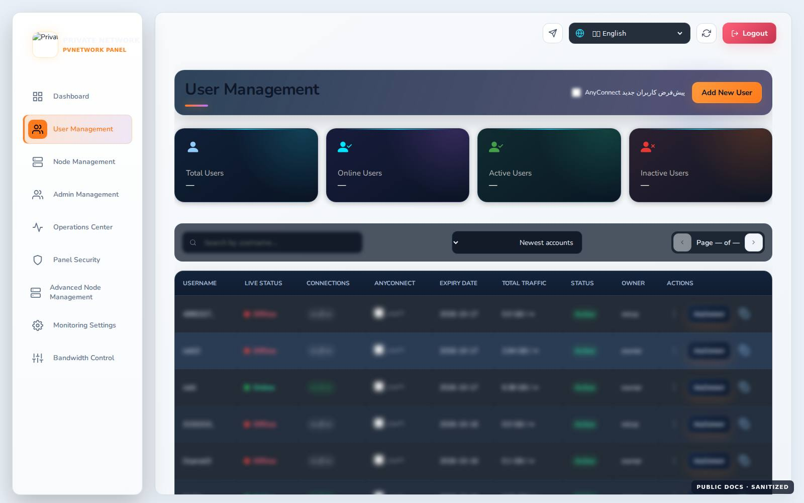

User Management covers the full account lifecycle.

| Control | Purpose |
|---|---|
| Add New User | Create an account and choose quota/duration/node assignment |
| AnyConnect default | Enable AnyConnect by default for new users |
| Search / Sort | Find and order accounts by status, usage, expiry or name |
| Edit | Change user properties |
| Renew | Extend an existing/expired account without recreation |
| Download | Get the supported connection output from assigned nodes |
| AnyConnect | Manage AnyConnect state and credentials for the same user |
| Domain History | Main-admin view of recorded domain activity |
| Reset Usage | Reset usage; unlimited accounts also start a fresh 30-day period |
| Activate / Deactivate | Toggle the existing identity |
| Delete | Controlled account deletion |
| Copy Link | Copy the subscription link |

Renewal preserves UUID, username and node assignments.
### Create user

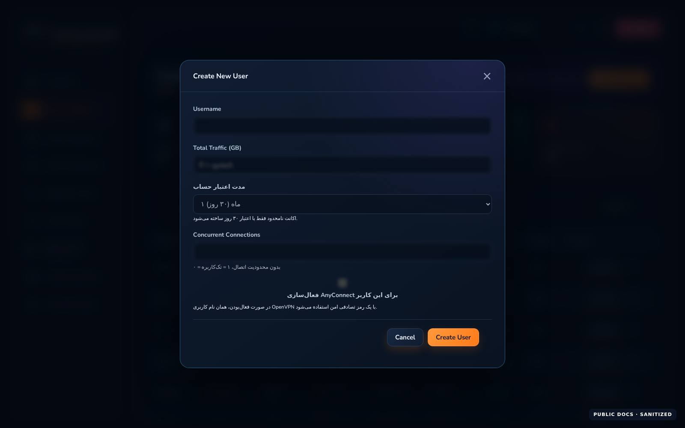

The create dialog supports quota, duration, node assignment and optional AnyConnect. A zero traffic quota represents an unlimited plan; the unlimited baseline period is 30 days.

### User actions menu

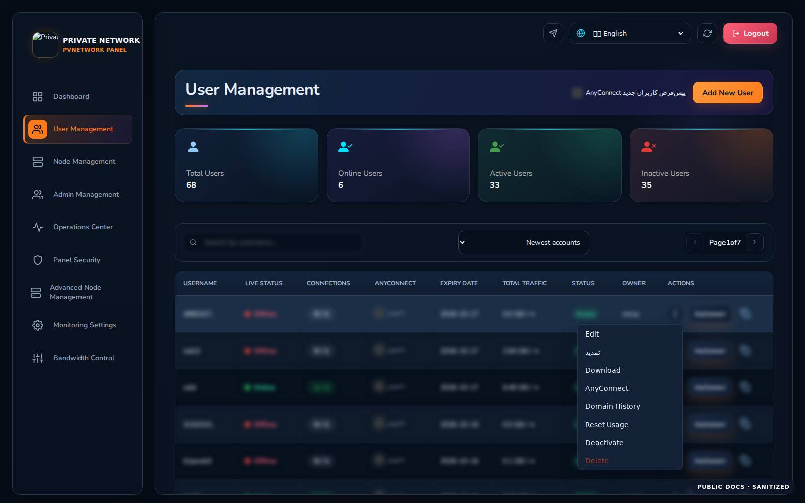

The actions menu groups common lifecycle controls and keeps destructive actions visually separate.

### Inline Quick Edit — v1.0.3

Use **Quick Edit** for frequent safe changes without opening the full Edit dialog. Traffic quota, expiry when policy permits, concurrent-device limit, active state, assigned nodes and an optional Reset Usage are available together. On phones/tablets the editor leaves the horizontally scrollable table and becomes a full-width panel, so Apply/Cancel/Reset and node choices remain reachable. Username stays read-only because changing it also changes node-side client/profile names; safe rename is tracked separately as `PVN-022`.

Assignment behavior is conservative: removing a node deactivates that profile instead of deleting its certificate; re-adding can reuse a stale disabled profile; newly selected unavailable nodes are rejected before mutation.

### Renew user

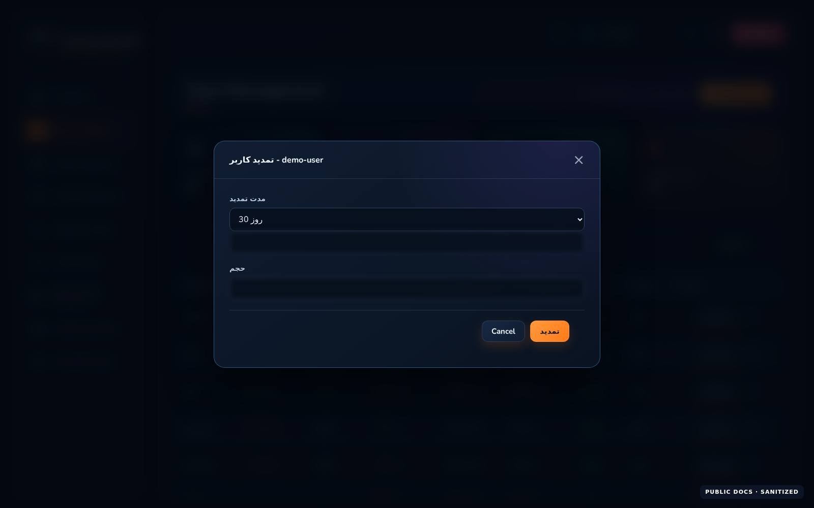

Renewal reuses the same UUID and username. Finite plans support preserve, reset and add-traffic modes; expired users are reactivated and synchronized to their assigned nodes.

### AnyConnect

The AnyConnect dialog manages account state and credential generation/change while keeping the same panel user identity.
## Subscription page — v1.0.2

The public Subscription page presents status/usage, expiry, simultaneous-device allowance, smart node choices, client downloads, Linux install command, AnyConnect credentials and renewal notifications. On narrow screens, Copy/Test/Renew controls keep a 44px touch floor, long usernames/hosts wrap inside their cards, and the page itself must not horizontally scroll. The language and theme controls remain reachable.

## 3. Node Management

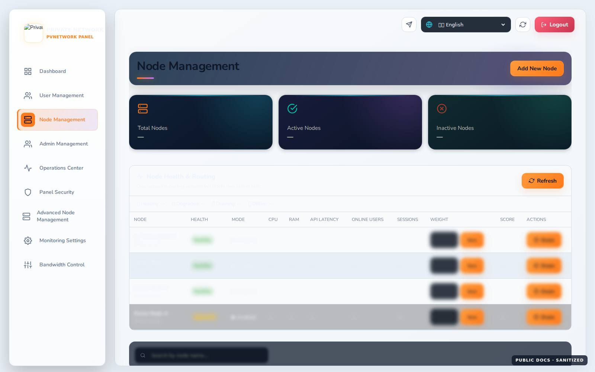

Node Management provides base CRUD and health visibility for OpenVPN nodes.

| Control | Purpose |
|---|---|
| Add New Node | Register or deploy a node |
| Refresh | Reload node inventory |
| Health Refresh | Refresh health and routing information |
| Edit | Change node settings |
| Delete | Controlled removal with assignment checks |

### Add node

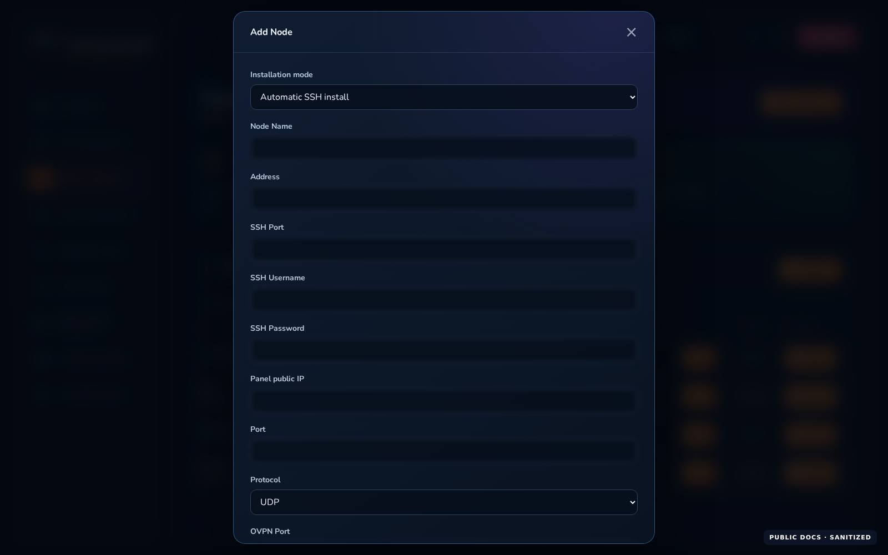

The dialog supports automatic and manual modes. API port, OpenVPN port, protocol and tunnel address are configurable. Automatic deployment must preserve unrelated services, routes and firewall rules on shared hosts.

## 4. Admin / Reseller Management

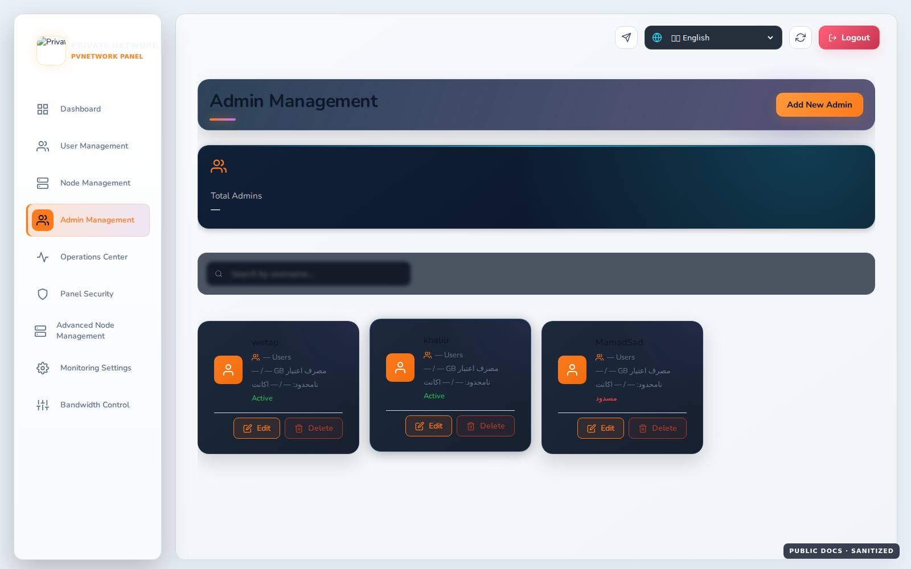
Main admins can create, edit and remove reseller/admin accounts. Search and quota/permission controls are available; removal can transfer owned users instead of deleting them.

### Add admin

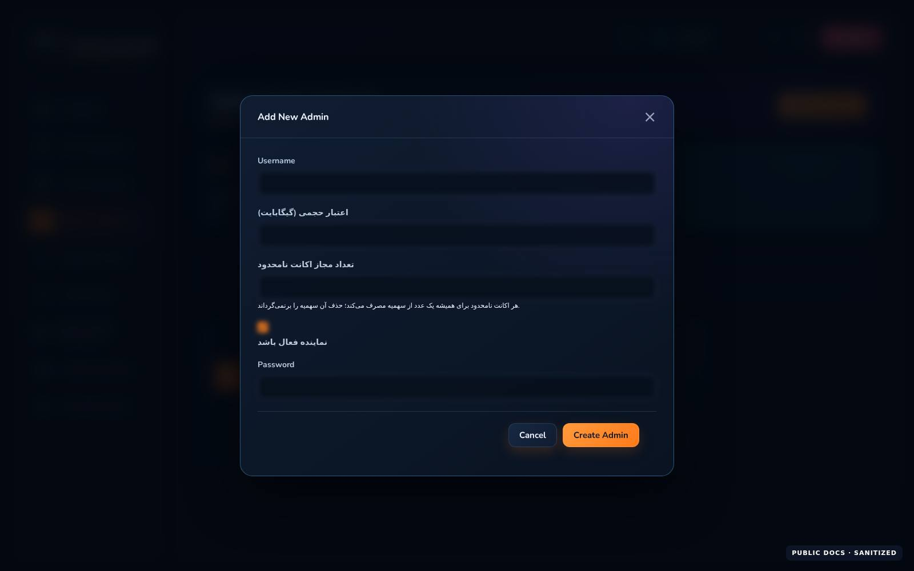

Use the reseller/admin dialog to define the supported permissions and quotas. Transferring users before removing an owner is the safer lifecycle path.

## 5. Operations Center

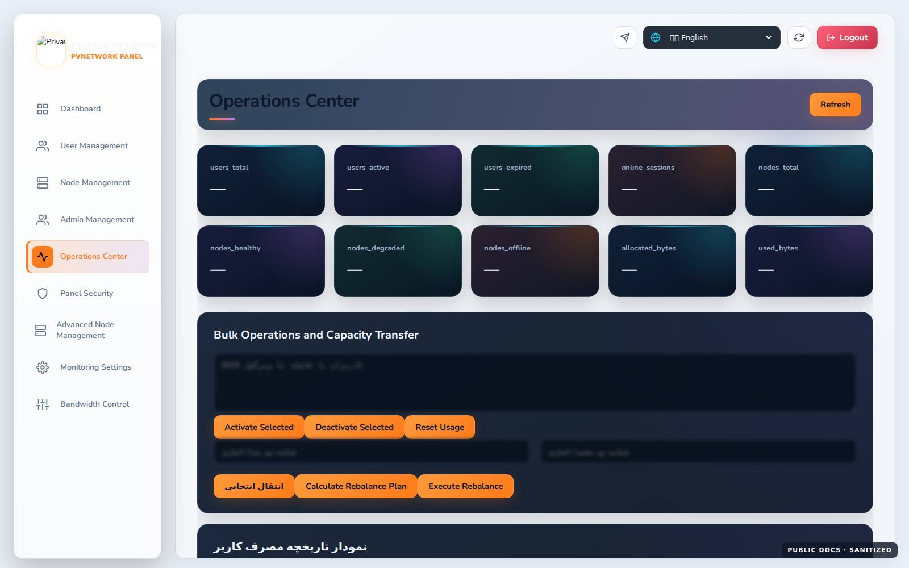

| Tool | Purpose |
|---|---|
| Refresh | Reload operational dashboard |
| Bulk Activate / Deactivate | Change many UUIDs in one operation |
| Bulk Reset Usage | Reset usage for multiple accounts |
| Transfer | Move workload/assignment from source to target |
| Auto Rebalance | Apply the calculated rebalance |
| Rebalance dry run | Preview the rebalance without applying it |
| Usage History | Load usage history for one UUID |
| Backup / Restore | Create, download and guardedly restore verified backups |

Restore is confirmation-gated and exposes progress/status while it runs.
## 6. Panel Security

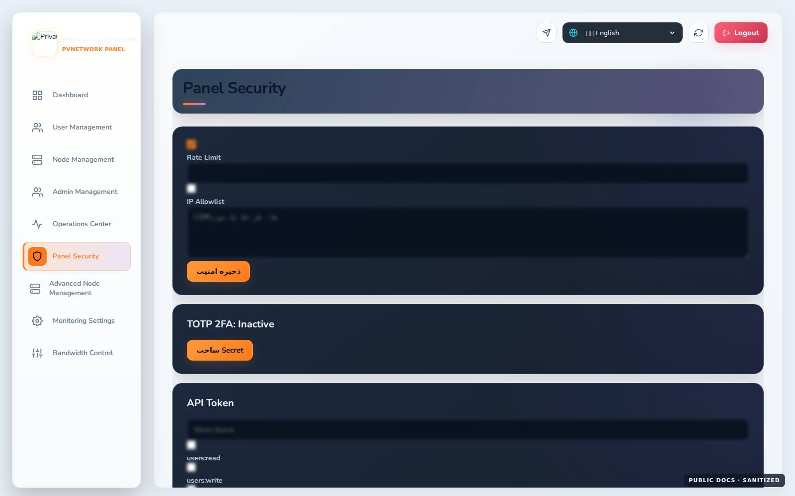

| Control | Purpose |
|---|---|
| Rate Limit | Limit request rate |
| IP Allowlist | Restrict management access to approved CIDRs |
| TOTP 2FA | Create, confirm or disable two-factor authentication |
| API Token | Create named, scoped and expiring API access |
| Revoke | Revoke an issued token |

Security values are deliberately obscured in public screenshots.

## 7. Advanced Node / Fleet Management

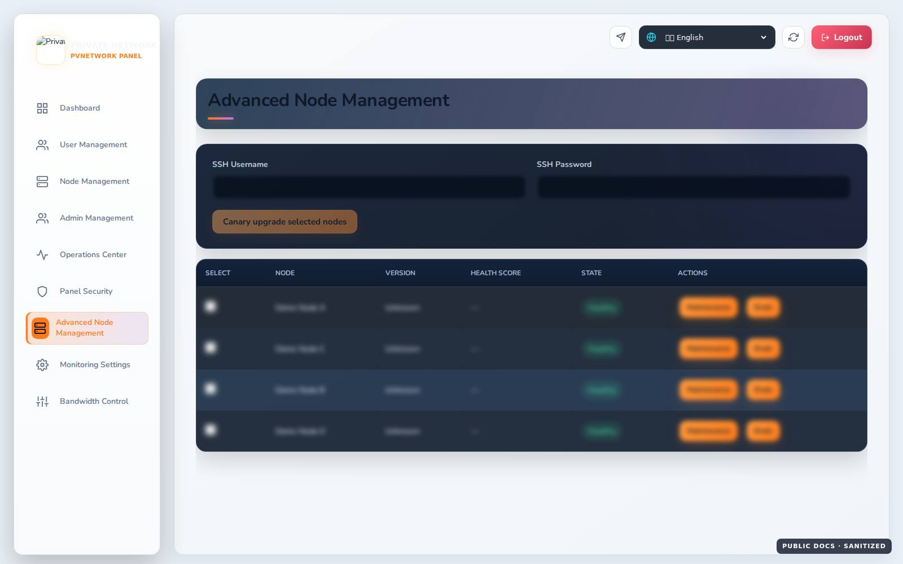

| Control | Purpose |
|---|---|
| Select Nodes | Choose fleet targets |
| Upgrade | Start a controlled upgrade job |
| Retry | Retry a failed job |
| Maintenance | Temporarily remove a node from normal operation |
| Leave Maintenance | Return the node to normal mode |
| Drain | Stop new workload/session placement and drain gracefully |
| Resume | Return a drained node to service |
| Refresh | Refresh health/version/job state |
Fleet rows expose health, mode, CPU, RAM, API latency, online users, sessions, weight and score for operational decisions.

## 8. Monitoring Settings

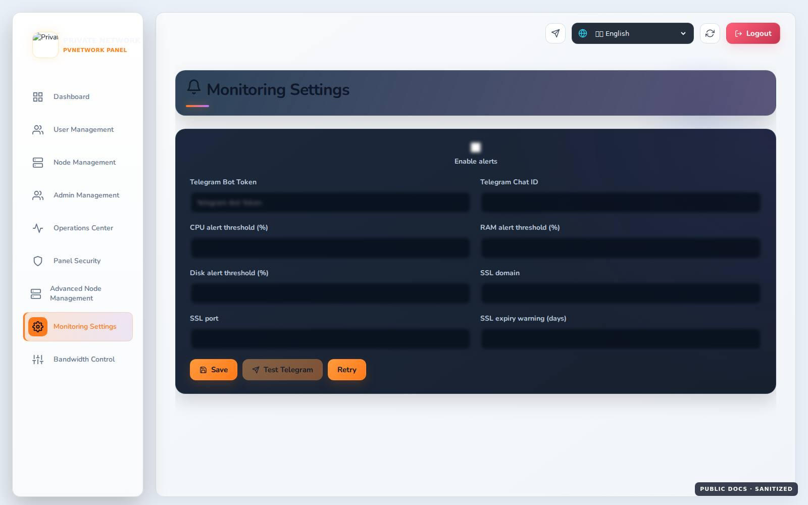

Monitoring Settings manages alerting and Telegram monitoring. Save persists settings, Test Telegram sends a verification message, and Retry/Refresh reloads current state.

## 9. Bandwidth Control

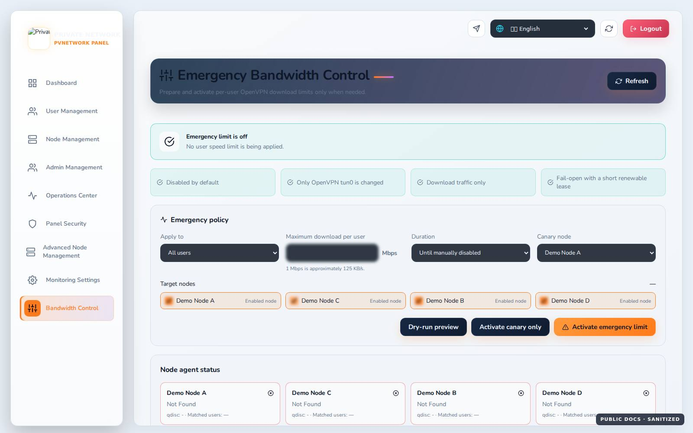

| Control | Purpose |
|---|---|
| Refresh | Reload settings, groups and node state |
| Emergency Off | Immediately disable the active bandwidth policy |
| Preview | Show targets/effect without applying changes |
| Canary | Apply a policy to one selected node first |
| Activate | Apply the policy to the final target set |
| Create Group | Create a user group for policy targeting |
| Save Members | Persist group membership |
| Delete Group | Remove a policy group |

Node Status shows application state per node; Last Result shows the most recent operation outcome.

## Safe workflow for sensitive operations

For fleet changes, bandwidth policies, restore and updates, check health/preview/backup first, apply to a small scope, verify the result, then expand.

All public screenshots use demo/sanitized data and do not represent the capacity or configuration of any specific deployment.

[Back to README](../README.md) · [راهنمای فارسی](./UI-GUIDE.fa.md)
